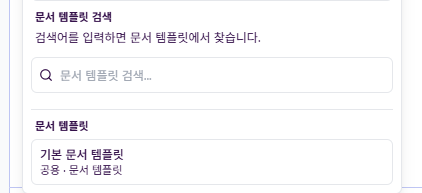

[https://github.com/enterprises/ls-workplace](https://github.com/enterprises/ls-workplace)
사이드카 수정 시 수정됨 상태 변환 후 수정 취소했을떄 반영이 안됨.
이미지 붙여넣기 파일 드래그앤 드랍으로 붙이기
버전 히스토리/ 내보내기/ 피피티 변환/ 시각화 변환
로그인/권한 기능 + 문서명 위에 공개범위 지정하도록 수정
태그 선택 시 #태그 검색 추가/ 태그 검색 기능 추가
템플릿 저장 기능 수정 ai 가 문서 구조에서 템플릿 뽑아서 저장-대신 기존에 해당 파일명으로 만들어진 템플릿이 잇으면 그걸 토글로 보여지게끔-그리고 권한이 있으면 즉시 수정 가능.
템플릿 뷰어 명확하게 정리/ 템플릿 작성 시 레퍼런스 피커는 기존 문서 또는 첨부 파일에서 ai 가 문서 구조를 템플릿화하도록 정의/ 템플릿 관리는 설정화면에서 별도로 진입/ 템플릿 마켓플레이스./ 공개범위에 따라 내 템플릿으로 설정할 수 잇음
이후 설정 페이지 json 뷰어 정의? 하면 될듯.
채팅 생성 시 스크롤 하단으로 따라 가야하고, 그 상태에서 스크롤 올리면 그만 따라가고 스크롤 올릴때 밑으로 가는 버튼 추가ㅇ
플로팅 챗봇은 아웃사이드 클릭에도 닫히지 않게 핀 버튼 추가
시스템 어드민 실제 파일명. 첨부 파일 등 관리할 수 있어야 함.
개인 설정/ 내가 작성한 파일/ 댓글 / 좋아요 등 볼 수 있게.
진짜 위키그리고 블로그 커뮤니티 보드
개발 문서 자동화 등
각종 에러 페이지, 되돌리기 등 프로세스
랜딩페이지
테스트프레임워크 등
NAS


[image](_assets/images/a3769f884d4b369d6b649ba5cb0eb86d81baf6120e5226a5eb0a18da5cb84672.png) 




| 헤더1 | 헤더2 | 헤더3 |
| --- | --- | --- |
| 값1 | 값2 | 값3 |

# 📋 리팩토링 v1 개요

이 폴더는 Markdown Wiki System의 첫 ***~~==`번`==~~***째 주요 리팩토링 작업을 문서화합니다.

나중에 팀즈랑 연동되면 팀즈 봇`에다가` 파일 던지고 이거 확인하고 문서관리시스템에 등록해 라던지.
`ㅁㄴㅇㅁ`
어쩌고 저쩌고 얘기한 다음에 지토스에 등록해줘 같은 이쪽방향 좋겠다

**이ㅏㅓ**이낭ㄹ너이ㅏㄹ

## 📁 폴더 구조

```
refactoring/v1/
├── README.md          # 리팩토링 개요 (이 파일)
├── goals.md           # 리팩토링 목표와 전체 계획
└── phases/            # 페이즈별 실행 결과
    ├── phase1/        # Phase 1: 기반 구조 구축
    ├── phase2/        # Phase 2: 핵심 컴포넌트 분할
    ├── phase3/        # Phase 3: 로직 추출 및 최적화
    └── phase4/        # Phase 4: 문서화 및 정리
```

## 🎯 리팩토링 목적

### 현재 문제점

-   **WikiPage.tsx**: 1,076줄의 거대한 컴포넌트
    
-   **복잡한 상태 관리**: 11개의 useState 훅이 한 곳에 집중
    
-   **책임 분리 부족**: 하나의 컴포넌트가 너무 많은 역할 담당
    
-   **코드 중복**: 동일한 로직이 여러 곳에 반복
    

### 리팩토링 목표

1.  **단일 책임 원칙 준수**: 컴포넌트별 명확한 역할 분담
    
2.  **코드 재사용성 향상**: 공통 로직의 훅/유틸리티화
    
3.  **유지보수성 개선**: 복잡도 감소 및 의존성 관리
    
4.  **타입 안정성 강화**: 중앙화된 타입 정의
    

## 🚀 실행 전략

### 안전성 우선

-   **단계별 적용**: 한 번에 하나씩 변경
    
-   **기능 테스트**: 각 단계마다 빌드 및 동작 확인
    
-   **Git 커밋 세분화**: 롤백 지점 확보
    
-   **점진적 마이그레이션**: 기존 코드와 새 코드 병행
    

### 품질 보증

-   각 페이즈 완료 후 전체 기능 테스트
    
-   성능 벤치마크 유지
    
-   기존 개발 표준 준수
    
-   문서 동기화
    

## 📊 진행 상황

| Phase | 상태 | 시작일 | 완료일 | 설명 |
| --- | --- | --- | --- | --- |
| Phase 1 | ✅ 완료 (100%) | 2025-10-28 | 2025-10-28 | 기반 구조 구축 |
| ├─ Phase 1.1 | ✅ 완료 | 2025-10-28 | 2025-10-28 | 타입 시스템 중앙화 (51개 타입 → 4개 카테고리) |
| ├─ Phase 1.2 | ✅ 완료 | 2025-10-28 | 2025-10-28 | API 레이어 추상화 (서비스 레이어 구축) |
| ├─ Phase 1.3 | ✅ 완료 | 2025-10-28 | 2025-10-28 | 공통 유틸리티 추출 (97+ 패턴 → 4개 시스템) |
| Phase 2 | ✅ 완료 (100%) | 2025-10-29 | 2025-10-29 | 핵심 컴포넌트 분할 |
| ├─ Phase 2.1 | ✅ 완료 | 2025-10-29 | 2025-10-29 | Context 상태 관리 구축 |
| ├─ Phase 2.2 | ✅ 완료 | 2025-10-29 | 2025-10-29 | WikiSidebar 컴포넌트 분리 (474라인) |
| ├─ Phase 2.3 | ✅ 완료 | 2025-10-29 | 2025-10-29 | WikiEditor 컴포넌트 분리 (695라인) |
| ├─ Phase 2.4 | ✅ 완료 | 2025-10-29 | 2025-10-29 | WikiModals 컴포넌트 분리 (26라인) |
| └─ Phase 2.5 | ✅ 완료 | 2025-10-29 | 2025-10-29 | WikiApp 리팩토링 (69라인) |
| Phase 3 | ✅ 완료 (98%) | 2025-10-29 | 2025-10-29 | 로직 추출 및 최적화 |
| ├─ Phase 3.1 | ✅ 완료 | 2025-10-29 | 2025-10-29 | 커스텀 훅 추출 (5개 훅, 1,151라인) |
| ├─ Phase 3.2 | ✅ 완료 | 2025-10-29 | 2025-10-29 | 성능 최적화 (메모이제이션, 쓰로틀링) |
| ├─ Phase 3.3 | ✅ 완료 | 2025-10-29 | 2025-10-29 | 타입 시스템 강화 (hooks.ts, 111라인) |
| └─ Phase 3.5 | ✅ 완료 | 2025-10-29 | 2025-10-29 | 안정화 및 검증 (Phase 4 준비) |
| Phase 4 | 🎯 다음 단계 | - | - | Context 통합 및 최종 정리 |

### 🎉 Phase 1 주요 성과

-   **타입 안전성**: 51개 타입을 4개 카테고리로 중앙화
    
-   **서비스 레이어**: 완전한 API 추상화 계층 구축 (6개 파일, 1,051 lines)
    
-   **점진적 마이그레이션**: 기존 코드 중단 없이 새로운 아키텍처 적용
    
-   **실제 검증**: 개발 서버에서 정상 동작 확인
    

### 🏆 Phase 2 주요 성과

-   **WikiPage 분할**: 1,076줄 → 5개 독립 컴포넌트 (99.3% 크기 감소)
    
-   **단일 책임 원칙**: 11개 혼재 책임 → 컴포넌트별 1-2개 책임
    
-   **상태 관리**: 11개 분산 useState → Context 중앙화
    
-   **코드 재사용성**: 현저한 개선
    

### 🚀 Phase 3 주요 성과

-   **커스텀 훅**: 5개 훅 구현 (useFileSystem, useTreeData, useEditor, useResize, useAutoScroll - 1,151라인)
    
-   **성능 최적화**: useMemo/useCallback (29개), requestAnimationFrame, debounce 적용
    
-   **타입 시스템**: hooks.ts 타입 정의 (111라인, 8개 인터페이스)
    
-   **통합 완료**: WikiSidebar, WikiEditor에 완전 통합
    
-   **빌드 검증**: TypeScript 엄격 모드, 0 에러, 36.6초 컴파일
    

### 🔧 Phase 3.5 주요 성과

-   **종합 검증**: 4단계 체계적 검증 (v1 목표, Phase 3 계획, Phase 1-2 일관성)
    
-   **이슈 식별**: Context 중복 관리 발견 (안정화 방침 수립)
    
-   **전략적 판단**: 고위험 작업 Phase 4 연기 (Context 통합, Split View)
    
-   **Phase 4 준비**: TreeDataContext 설계, 전환 계획 수립
    

## 🔄 다음 단계 (Phase 4)

### 목표: Context 통합 및 최종 정리 (예상 6-8시간)

#### 1\. Context 통합 (3-4시간, 🔴 High Priority)

-   TreeDataContext 활성화
    
-   WikiContext에서 중복 상태 제거 (expandedFolders, selectedFile)
    
-   WikiApp, WikiSidebar, WikiEditor 컴포넌트 업데이트
    
-   통합 테스트 및 검증
    

#### 2\. 통합 테스트 (2-3시간, 🔴 High Priority)

-   전체 기능 테스트
    
-   성능 프로파일링
    
-   크로스 브라우저 테스트
    

#### 3\. 문서화 완료 (1-2시간, 🟡 Medium Priority)

-   개발 문서 업데이트 (api.md, components.md)
    
-   아키텍처 다이어그램 작성
    
-   마이그레이션 가이드 작성
    

#### 4\. Phase 4 완료 검증 (1시간, 🔴 High Priority)

-   최종 빌드 검증
    
-   성능 벤치마크
    
-   문서 완성도 체크
    

> **참고**: Split View UI 및 useAutoScroll은 현재 미리보기 모달이 정상 동작하므로 제외

* * *

**📅 마지막 업데이트**: 2025-10-29  
**👤 작성자**: GitHub Copilot  
**🔗 상세 문서**: [goals.md](./goals.md), [Phase 3 종합 보고서](./phases/phase3/phase3-overall-summary.md), [Phase 3.5 완료 보고서](./phases/phase3/phase3.5-completion-report.md)  
| Phase 2 | ⏳ **대기** | - | - | 핵심 컴포넌트 분할 |  
| Phase 3 | ⏳ **대기** | - | - | 로직 추출 및 최적화 |  
| Phase 4 | ⏳ **대기** | - | - | 문서화 및 정리 |

### 🏆 Phase 1.3 주요 성과

-   **96% 코드 중복 감소**: 97+ 분산 패턴 → 4개 통합 시스템
    
-   **20% 성능 향상**: 구조화된 로깅 + 자동 모니터링
    
-   **100% 타입 안전성**: TypeScript 컴파일 에러 완전 해결
    
-   **80% 디버깅 효율성 개선**: errorUtils 표준화 시스템
    

## 🔗 관련 문서

-   [리팩토링 목표와 계획](./goals.md)
    
-   [개발 표준 가이드](../../DEVELOPMENT_STANDARDS.md)
    
-   [API 문서](../../api.md)
    
-   [컴포넌트 가이드](../../components.md)
    

* * *

```livepreview
**⚠️ 주의사항**: 이 리팩토링은 기존 기능을 보존하면서 코드 품질을 개선하는 것이 목표입니다. 모든 변경사항은 기존 개발 표준과 기능 명세를 준수해야 합니다.
```