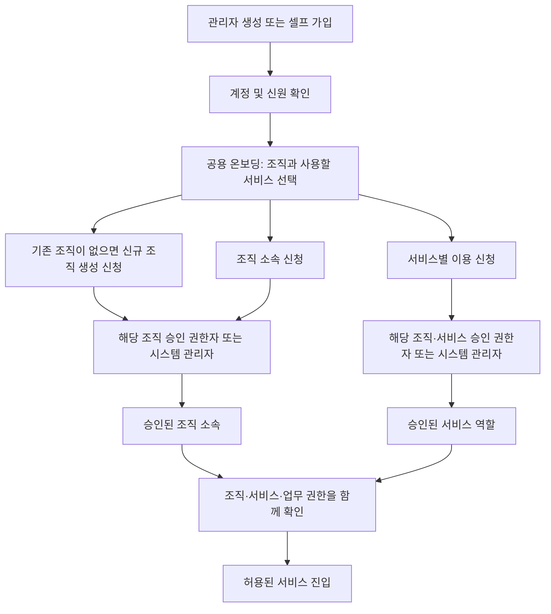

# 계정 생성 이후 조직·서비스 이용 승인 검토

> 2026-10-01 · 현행 점검 완료 · 아래 온보딩·승인 흐름은 제안이며 미구현

> 최신 기준: 사용자는 그룹사 등을 포함한 **하나의 폐쇄형 플랫폼**을 바깥 경계로 확정했다. 회사·부서·팀은 그 안의 조직이며, 문서·게시물 소유자는 개인으로 유지한다. 개인/조직/전체에서 전체는 플랫폼 내부 회사 간에도 공유되는 범위다. 업무 생성 문서도 개인 소유 + 업무 조직 자동 공개다. 아래 기존 모델 관찰과 목표를 구분하며, 구체적인 앱별 준비 상태·부족한 경로·종료 조건은 [서비스 기반 점검](2026-10-01-service-onboarding-readiness.md)을 따른다.

사용자는 Admin에서 사용자를 생성하고 그 계정으로 로그인하는 데 성공했으나, 조직 소속 및 사용할 서비스의 권한을 결정하는 단계가 빠져 있다고 보고했다. 관리자 생성과 향후 셀프 회원가입에 공통으로 적용할 가입 이후 흐름을 검토한다. 이번 작업은 코드·문서 대조와 실행 중인 로컬 Docker DB/권한 서비스의 읽기 전용 확인이다. 제품 코드, 실제 사용자 소속·권한, 배포 상태를 바꾸지 않았다.

## 확인한 현재 동작

| 구간 | 구현·실행 근거 | 부족한 부분 |
|---|---|---|
| Admin 사용자 생성 | `UserManagementPage`는 기본 역할 `user`, 선택 입력 부서 코드·회사·고객사·주 소속 유형을 전달한다. `UserService.create`는 인증 계정을 즉시 `active`로 생성한다. | 생성 과정에 서비스별 이용 신청·승인 상태가 없다. 역할 선택과 서비스 이용 승인이 구분되지 않는다. |
| 조직 연결 | `syncOrganizationFoundation`이 부서 코드나 회사/고객사로 조직을 찾거나 만들고 활성 소속 관계를 연결한다. 입력이 없으면 조직 없이 생성된다. | 등록된 조직을 선택하고 권한자가 소속을 확인하는 절차가 없다. 계정 생성 트랜잭션 종료 후 소속 동기화를 실행하므로 소속 처리 실패 시 계정만 남을 수 있다. |
| 권한 계산 | `AccessFoundationService`가 전역 역할·조직 상속·개인 예외를 합산한다. 조직이 없어도 역할 권한이 유효하다. | 승인된 조직·서비스 이용권을 필수 전제로 삼는 공용 조건이 없다. |
| PMS | 별도 메뉴 정책에서 일반 `user` 역할의 기본값이 `read`다. | 공용 permission grant만 바꿔도 PMS 메뉴 기본 접근은 남을 수 있다. 도메인별 접근 경계를 함께 점검해야 한다. |
| 기존 가입 신청 | Microsoft 가입 신청과 시스템 관리자 승인/반려가 있다. 신규 사용자 승인 시 기본 역할은 `user`다. | 가입 승인에 조직·서비스별 신청/결정은 포함되지 않는다. 조직 권한자의 위임 범위도 없다. |
| 조직 권한자 | 소속 모델에 `isLeader` 필드는 있다. 조직 CRUD와 가입 승인 API는 시스템 관리자 권한으로 제한한다. | 조직장 표시만으로 가입/서비스 승인 기능이 생기지는 않는다. 대상 조직·서비스에 대한 명시적 승인 권한이 필요하다. |
| 셀프 가입 | 인증 정책 서비스는 셀프 회원가입 활성화를 거절한다. 초대 테이블은 있으나 이것만으로 온보딩 구현을 뜻하지 않는다. | 현재의 일반 역할 즉시 부여를 셀프 가입에 그대로 확대하면 같은 문제가 이어진다. |

로컬 DB의 활성 `user` 역할 계정 8개 중 활성 조직 관계가 없는 계정은 1개였다. 사용자 식별정보를 출력하지 않고 해당 계정에 대해 배포된 서버의 실제 권한 서비스 메서드를 읽기 전용 트랜잭션에서 실행했다.

| 확인 항목 | 결과 |
|---|---|
| 유효 조직 수 / `system.override` | 0 / false |
| 공용 action permission | 25개 |
| CRM 영업기회 | 조회·등록·수정 가능, 확정·차수 추가 불가 |
| DMS | 문서 읽기·쓰기·템플릿 관리·검색·AI 가능, 시스템 설정·저장소·Git 불가 |
| SNS | 피드 조회·게시·댓글·반응·팔로우 가능, 게시판·스킬 관리 불가 |
| PMS | 접근 가능한 표시 메뉴 4개 |

증거: `output/onboarding-review/20261001/read-access.mjs`, `read-access.json`. 이는 기능 권한 계산 결과이며 모든 개별 문서·프로젝트에 접근했다는 뜻이 아니다. 특정 사용자 로그인 재현, 실제 업무 쓰기, 새 가입 요청은 수행하지 않았다. 사용자 보고 계정과의 동일성도 단정하지 않는다.

## 조직 중심 설계와 현재 구현 대조

사용자는 핵심 기능·데이터를 조직에 귀속하도록 설계했던 것으로 기억한다고 확인을 요청했다. 현재 정본 문서, Prisma 스키마, 서비스 권한/조회 코드와 로컬 DB를 대조한 결과, **조직 기반 소속·권한 및 일부 업무의 소유 모델은 존재하지만 모든 데이터의 조직 소유·격리가 통일된 상태는 아니다.**

| 영역 | 실제 조직의 의미 | 현재 한계 |
|---|---|---|
| 공용 조직 | `Organization` 계층, 복수 사용자 소속과 유효기간, 조직별 permission 상속 | 회사·부서·프로젝트 조직을 표현한다. 별도 회사별 데이터 격리 경계나 현재 작업 조직을 확정한 모델과 동일하지 않다. 공용 권한은 유효한 상설 조직들의 grant를 합산한다. |
| PMS | `Project.ownerOrganizationId`로 소유 조직을 보관한다. 프로젝트 목록/상세 권한에 조직 소속을 반영한다. | 소유 조직은 nullable이고, 담당자·프로젝트 참여·명시 권한으로도 접근할 수 있다. 작업 등 하위 데이터는 프로젝트를 통해 범위를 이어받는다. |
| DMS | 문서의 소유자는 `ownerUserId`다. `visibilityScope=organization`과 `targetOrgId`로 조직 공개를 표현한다. | 조직은 공개 대상이며 모든 문서의 필수 소유 주체가 아니다. 개인 문서·로그인 사용자 전체 공개·개별 공유도 지원한다. |
| SNS | 게시물 작성자와 `public/organization/followers/self` 공개 범위를 구분한다. 조직 공개 시 주 소속 조직을 대상으로 저장한다. | 모든 게시물이 조직 소유인 모델은 아니다. 기본 공개 범위는 `public`이다. |
| CRM | 영업기회·고객·계약은 담당 사용자와 공용 기능 권한/객체 예외를 사용한다. | 이들 주요 원장에 소유 조직 키가 없다. 영업기회·계약 목록 조회도 현재 사용자 조직을 인자로 받아 한정하지 않는다. 조직별 원장 격리가 구현됐다고 볼 수 없다. |

확인 근거는 [PMS 조직 설계](../../../pms/planning/spec-reconciliation-plan.md), [PMS 목록 범위](../../../../apps/server/src/modules/pms/project/project.service.ts), [PMS 객체 권한](../../../../apps/server/src/modules/pms/project/project-access.service.ts), [DMS 공개/공유 정본](../../../dms/explanation/domain/document-visibility-and-access-model.md), [SNS 공개 범위](../../../../apps/server/src/modules/sns/access/access.service.ts), [CRM 권한 정본](../../../crm/reference/crm-domain-access-policy.md), [CRM 목록 조회](../../../../apps/server/src/modules/crm/contract/contract.service.ts)다. 과거 planning 문서의 단계별 미구현 표기보다 현재 코드·스키마를 우선해 판정했다.

로컬 DB 읽기 전용 확인에서는 프로젝트 6개 모두 소유 조직이 있었다. DMS의 활성 `organization` 문서 34개는 `target_org_id`가 모두 비어 있었다. 전체 DMS master 행 수는 삭제/비활성 행을 포함하므로 파일 개수와 같지 않다. [문서 ACL 코드](../../../../apps/server/src/modules/dms/access/document-acl.service.ts)의 `isVisibilityReadable`은 조직 공개의 대상 조직이 비어 있으면 조직 소속이 있는 사용자에게 visibility read를 허용하는 호환 처리가 있다. 특정 문서에 대한 다른 조직 계정의 HTTP 접근을 재현한 결과는 아니지만, 조직 간 격리 기준으로 사용하기 전에 정리할 항목이다. 이번 점검에서 기존 문서나 권한을 바꾸지 않았다.

온보딩 설계에는 사용자 소속 승인뿐 아니라 **어느 조직의 구성원으로 어느 서비스·업무 범위를 사용하는지**를 포함한다. 후속 사용자 설명에 따라 다음 기준을 적용한다.

- 그룹사 전체처럼 플랫폼을 도입·운영하는 울타리가 바깥 경계다. 개별 회사·부서·프로젝트 조직은 그 안의 업무/공유 범위다. 조직 계층이 있다는 이유로 상위/하위 조직의 데이터 권한이 자동 상속된다고 가정하지 않는다.
- 문서·게시물의 개인 소유자와 업무/공개 조직을 구분한다. PMS·CRM에서 발생한 문서도 소유자를 조직으로 바꾸지 않고 원천 업무 조직으로 자동 공개한다. 담당자의 조직 이동으로 과거 자료가 자동 이전되는 방식은 사용하지 않는다.
- 서비스 이용 승인과 자료 공유 범위를 구분한다. 복수 조직 사용자는 어떤 조직에서 승인받은 서비스인지 식별해야 한다.
- DMS·SNS의 개인/조직/전체 기준을 맞추되, 전체는 플랫폼 내부 여러 회사의 허용 사용자에게 공개될 수 있다. 개별 공유와 개인 자료 검색 노출은 별도로 정리하며 기존 공개 자료를 임의로 비공개 처리하거나 개인 자료를 자동 공개하지 않는다.

## 사용자 방향을 반영한 공통 흐름

관리자 생성도 셀프 가입도 ID 생성·접속 이후 공용 온보딩을 노출하고 사용자가 직접 신청한다는 방향을 반영한다. 앞선 초안의 관리자 생성 시 온보딩을 생략하는 직접 승인 제안은 채택하지 않는다. 조직 생성 승인자·최초 조직 관리자, 서비스 승인자의 조직별 범위, 조직 심사 중 서비스 동시 신청 여부는 상세 정책 검토 대상으로 유지한다.

1. **계정 상태와 업무 이용 상태를 분리한다.** 인증을 마친 계정은 온보딩·내 신청 상태·계정 보안·로그아웃에 접근할 수 있다. 조직 또는 서비스 승인이 없으면 업무 이용 권한은 부여하지 않는다. 계정을 비활성화해 온보딩 로그인 자체를 막는 방식은 사용하지 않는다. 셀프 가입의 이메일/외부 신원 확인은 이보다 앞선 조건이다.
2. **조직 소속과 서비스 이용을 각각 결정한다.** 신청서는 한 화면에서 제출하되 조직 신청과 서비스별 결과를 분리한다. 예를 들어 조직 승인 + CRM 승인 + DMS 대기라면 CRM만 이용할 수 있다. 조직 확인 전에 서비스 권한이 먼저 활성화되면 안 된다.
3. **관리자 생성도 공통 온보딩을 따른다.** 계정 생성 후 사용자가 접속해 기존 조직 소속 또는 신규 조직 생성을 신청하고, 사용할 서비스를 선택한다. 해당 권한자의 승인으로 소속과 이용 권한이 유효해진다. 관리자 생성이라는 이유로 온보딩을 생략하거나 서비스가 자동 승인된 것으로 처리하지 않는다.
4. **조직 권한자에게 승인 범위를 명시한다.** 위임된 조직과 서비스, 부여 가능한 역할 범위 안에서만 승인할 수 있다. 조직 소속 승인만으로 모든 앱 승인 권한을 얻지 않는다. 자기 신청·자기 권한 상향은 다른 권한자 또는 시스템 관리자에게 넘긴다. 조직 권한자에게 전체 Admin 접근권이나 전역 `admin` 역할을 요구하지 않는다.
5. **진행 상태와 복구 동선을 제공한다.** 신청 전·심사 중·승인·반려·취소, 반려 사유와 재신청을 구분한다. 이용 중 권한 회수·만료는 신청 결과와 별도로 표시한다. 승인 대기는 정상 업무 상태이며 오류 템플릿으로 처리하지 않는다. 실제 요청·저장 실패는 기존 공용 오류 템플릿과 재시도를 사용한다.

접근 조건은 **활성 계정 + 승인된 플랫폼 참여/소속 + 서비스 이용 승인 + 서비스 내 공개·업무 권한**이다. 조직 한정 콘텐츠나 PMS·CRM 업무에는 대상 조직/참여 관계를 추가 확인한다. 전체 공개 자료는 개별 회사가 달라도 같은 플랫폼의 허용 사용자에게 열릴 수 있다. 서비스 승인만으로 모든 개인·조직 한정 자료가 공개되는 것은 아니다. 시스템 관리자의 특별 접근은 별도 명시 정책과 감사 이력으로 다룬다.

## 구현 경계와 기존 동작 보존

- Account/Auth는 계정·신원·세션을 유지하고, 조직 신청·서비스 이용권·위임·승인 정본은 Admin/common access가 소유한다. `AuthIdentity`에 전체 소속·권한 모델을 넣지 않는다. [기존 책임 경계](auth-profile-boundary.md)를 따른다.
- 공용 온보딩과 내 신청 상태는 일반 사용자에게 열려 있어야 한다. Admin의 관리자 전용 layout이나 이미 승인된 서비스의 업무 layout 뒤에 두지 않는다. 다섯 앱이 같은 공용 상태·화면을 사용하고, 승인 전 직접 URL 진입도 그 상태로 안내한다.
- 현재 조직·소속·permission·이력 모델을 재사용하되, 신청 이력과 유효 소속/서비스 이용권을 분리한다. 서비스 이용권은 사용자·조직·앱·역할·유효기간·승인 근거를 식별해야 한다. 전역 `user` 역할을 선택한 것만으로 모든 앱의 역할을 결정하지 않는다.
- 승인 처리의 상태 전이, 소속/이용권 반영, 감사 기록은 원자적으로 처리한다. 중복 승인·동시 승인/반려·재시도에서도 권한이나 신청을 중복 생성하지 않는다. 알림 실패 때문에 처리 결과를 모호하게 만들지 않도록 기존 영속 알림 방식과 연결한다.
- 화면 메뉴뿐 아니라 서버 API, DMS 웹 파일 경로, 검색·AI·알림 및 앱 간 이동에도 서비스 접근 조건을 적용한다. PMS 메뉴 기본 권한과 기존 `system.override` 처리까지 검사한다.
- 조직 탈퇴·소속 회수·서비스 권한 회수 시 기존 세션과 열린 탭에서도 다음 보호 요청부터 반영돼야 한다. 공용 복구·다른 허용 서비스 이동·로그아웃 경로는 유지한다.
- 현재 사용자에게 새 기준을 적용할 때 기존 전역 역할을 일괄 제거하거나 전원을 재가입시키지 않는다. 기존 실효 권한을 먼저 목록화하고 조직/서비스 매핑과 예외를 검토한 뒤 명시적 이전 기록을 만든다. 조직 없는 기존 계정의 처리는 별도 검토 대상이며 이번에 차단하지 않았다.

## 구현 순서와 검증 기준

| 순서 | 구현 범위 | 완료 판단 |
|---|---|---|
| 1 | 조직·서비스 이용권과 승인 위임 계약, 기존 계정 이전안 | 계정/소속/서비스/업무 권한 경계 및 기존 계정 영향이 명시됨 |
| 2 | 관리자 생성과 셀프 가입의 공용 온보딩 진입 및 상태 표시 | 생성 경로와 무관하게 사용자가 조직·서비스 신청을 시작하며 자동 이용 권한 부여 없음 |
| 3 | 공용 온보딩·내 신청 상태와 범위 제한 승인함 | 신청·부분 승인·반려·철회·재신청·무권한 거절, 관리자/조직 권한자 흐름 확인 |
| 4 | 다섯 앱과 관련 API 접근 조건 연결 | 신규 무소속 사용자 직접 URL/API 거절, 승인 앱만 허용, 미승인 앱·타 조직 자료 거절, 회수 즉시 반영 |
| 5 | 셀프 가입 진입 연결 | 신원 확인 후 같은 온보딩으로 진입, 신청만으로 소속·업무 권한 활성화 안 됨 |

다중 조직 사용자에 대해서도 승인된 조직 범위가 섞이지 않아야 한다. 첫 화면은 주 소속 중심으로 단순화할 수 있지만 기존 복수 소속 데이터를 삭제해서는 안 된다. 조직 권한자가 없는 경우 시스템 관리자가 처리할 수 있어야 한다. 초기 조직/시스템 관리자 설정은 일반 가입 신청과 분리한다.

## 점검 상태와 후속 범위

- 현행 코드·DB·실제 권한 서비스 읽기 전용 확인 완료. 제품 변경·권한 변경·Docker 재배포 없음.
- 작업 전 preflight는 이번 점검과 무관한 CRM 검증에서 실패했다: `verify-ai-rag-platform.mjs`의 `CRM opportunity service spec must cover confirm locking`. 별도 CRM 작업 파일을 수정하지 않았으며 전체 preflight 통과로 기록하지 않는다.
- 후속 조직 소유 범위 점검 시 실행한 preflight는 통과했다. 이전 실패 기록과 구분하며, 이번 점검에서는 CRM 제품 파일을 수정하지 않았다.
- 이 문서는 가입 이후 승인 구조의 검토안이다. 기존 사용자의 서비스 접근을 바꾸는 제품 적용은 사용자와 이전 범위를 확정한 뒤 진행한다.

## 확인 소스

- [Admin 사용자 화면](../../../../apps/web/admin/src/components/pages/users/UserManagementPage.tsx)
- [사용자 생성·조직 연결](../../../../apps/server/src/modules/common/user/user.service.ts)
- [공용 권한 계산](../../../../apps/server/src/modules/common/access/access-foundation.service.ts)
- [PMS 메뉴 기본 권한](../../../../apps/server/src/modules/pms/menu/menu-access-baseline.ts)
- [기존 가입 승인](../../../../apps/server/src/modules/common/auth/auth-registration.service.ts)
- [인증 정책](../../../../apps/server/src/modules/common/auth/auth-policy.service.ts)
- [조직 운영 진입 권한](../../../../apps/server/src/modules/common/access/organization-operations.controller.ts)
- [현재 스키마](../../../../packages/database/prisma/schema.prisma)

## Changelog

| 날짜 | 변경 |
|---|---|
| 2026-10-01 | 폐쇄형 플랫폼 전체를 바깥 경계로 정정하고 개인 소유/업무 조직 공개 및 회사 간 전체 공개 기준, 앱별 준비 상태 문서 연결 |
| 2026-10-01 | 사용자 공통 온보딩 방향 반영. PMS 조직 소유/DMS·SNS 공개 대상/CRM 담당자 중심의 차이와 로컬 DMS 대상 조직 누락을 확인 |
| 2026-10-01 | 조직 없는 일반 계정의 실효 권한 확인, 관리자 생성·셀프 가입 공통 온보딩/승인 검토안과 이전·검증 범위 기록 |
