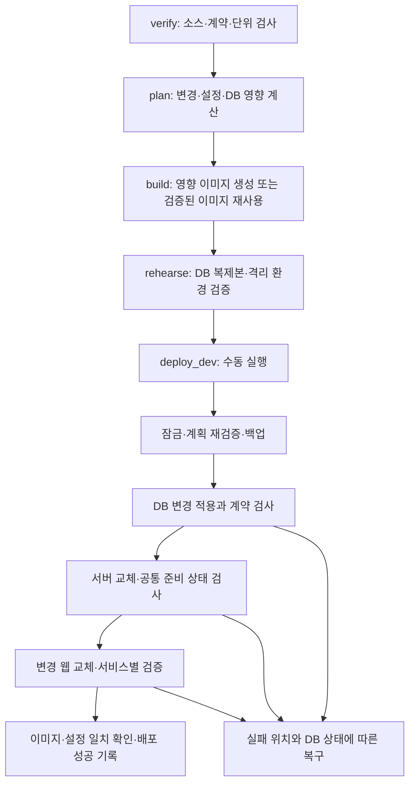

# SSOO GitLab 배포 구조 개선 설계

> 작성일: 2026-10-01\
> 상태: CRM 업무/배포 검사 분리 적용 (§18). Docker 복구 후 보존 이미지 기반 격리 리허설 24개 검사 통과 (§20). 최신 통합 후보와 원격 배포 검증은 별도\
> 범위: GitLab development → 준운영 단일 Docker 호스트, 공통 서버·5개 웹·DB 배포\
> 기준: GitLab development `2a2fbd7a208eb77b6763b16506f32f5bcb4384df`, 실제 배포 시도 #184 `704ea3b1`, 로컬 HEAD `e81cf1d7` 및 미커밋 개발본

## 1. 확인한 사실과 설계 결정

- GitLab #182~184의 verify/build는 성공했다. #184는 새 db-init exit 0, Nest 기동 성공 이후 server healthcheck 실패로 웹 앱이 시작되지 않았다.
- 기존 `/api/health/readiness`는 DB와 DMS 전체 readiness가 모두 ready여야 성공한다. DMS 검사는 설정 영속성, Git binding/parity, control-plane, 활성 저장 경로를 포함한다.
- #184의 상세 readiness 응답은 trace에 없다. Git 연결/권한/경로/timeout 중 실제 원인은 미확정이다. `git-not-initialized`는 조사 단서이며 확정 원인으로 취급하지 않는다.
- 자동 rollback의 이전 db-init은 새 DB에 구 스키마를 적용하려다가 데이터 손실 경고로 중단됐다. 이미지 복원이 DB 복원을 의미하지 않는다.
- GitLab에 staging overlay, 진단 및 DB 호환 수정이 추가돼 있다. 로컬 미커밋 개발본으로 덮어쓰지 않고 복구 변경과 개발 변경을 통합해야 한다.

결정: 기존 단일 호스트/Compose/shell runner를 유지한다. 공통 서버 기동 검사와 Admin/CRM/PMS/DMS/SNS 앱별 운영 검사를 분리한다. 기존 DMS strict 검사를 보존하고 전체 readiness를 5개 앱으로 확장한다. 배포는 불변 이미지 집합, 환경 설정, DB 변경 이력, 검증 증거를 묶은 release 단위로 관리한다. 자동 rollback은 DB 호환이 증명된 경우에만 허용한다.

단일 replica 교체 시 짧은 중단은 남는다. 이번 설계는 배포 전 실패 차단과 복구 가능성을 목표로 하며 무중단을 보장하지 않는다. Blue/green과 트래픽 전환 프록시는 별도 후속 범위다.

## 2. CI/CD 흐름

실서버 배포 경로는 **GitLab 원격 브랜치에 커밋을 push → 연결된 GitLab CI/CD pipeline 실행**이다(2026-10-02 사용자 재확인). 로컬 Docker 검증을 실서버 배포로 취급하거나 실서버에 직접 Compose를 실행하는 경로로 대체하지 않는다. 이번 격리 검증 승인은 원격 push 승인을 포함하지 않는다.



- `ai_review`는 기존처럼 비차단 단계로 보존한다. 실제 stage 순서는 `verify → ai_review → plan → build → rehearse → deploy → diagnose`다.
- `deploy_dev`의 수동 실행 및 실패 시 pipeline failed 계약을 유지한다. DMS 실패를 allow_failure로 숨기지 않는다.
- `diagnose_runtime`은 별도 diagnose stage의 수동·비차단 작업이다. 구형 GitLab에서 선행 실패 후 실행 가능 여부를 검증하고, 불가능하면 deploy 실패 처리에서 같은 읽기 전용 진단을 자동 실행한다.
- GitLab 10.4 제약은 원격 운영 문서에 기록돼 있다. `only`, `when`, 단계별 artifact 전달은 실제 인스턴스에서 검증하며 최신 `rules`/`needs`/`resource_group` 문법을 전제하지 않는다. pipeline API 변수 주입으로 안전 모드를 제어하지 않는다.
- plan/build/rehearse의 승인 입력과 산출물은 동일 pipeline ID·정확한 SHA에 결속한다. deploy에서 현재 브랜치 HEAD를 새로 따라가지 않는다.

## 3. Health API와 기동 의존성

| 경로 | 의미 | 응답/소비자 |
|---|---|---|
| 기존 `/api/health` | 프로세스 생존, release 정보 | 기존 계약 유지; 단독 배포 성공 기준으로 사용하지 않음 |
| 신규 `/api/health/core-readiness` | DB 질의, 공통 인증/설정 초기화, 해당 이미지가 요구하는 DB 계약 준비 | 200/503; Compose server healthcheck |
| 신규 `/api/health/apps/:app` | Admin/CRM/PMS/DMS/SNS 앱별 준비 | 200/503; 상태·안전한 코드·증거 만료시각 |
| 기존 `/api/health/readiness` | 플랫폼 전체 준비: 공통 서버 + 5개 앱 | DMS strict 의미 보존·앱 전체로 확장; 배포 완료 검사 |
| 5개 웹 `/api/health` | 해당 웹 프로세스·앱 식별자·실제 source SHA | 빌드/실행 이미지 확인; 인증·도메인 조회 검사와 함께 사용 |
| 기존 `/api/dms/settings/readiness` | DMS 항목별 상태·원인 | 기존 관리자 권한 유지; 상세 진단 |

현재 core-readiness는 SELECT 1 및 공통 session/provider 테이블 접근을 3초 한도로 검사한다. 5초 캐시와 진행 중 요청 병합을 사용한다. Admin/CRM/PMS/SNS는 각 도메인 테이블 접근, DMS는 기존 소유 서비스의 runtime readiness와 만료시각을 검사한다. CRM 회사정보·로고·템플릿 검토·업무 데이터 품질은 기존 `/api/crm/operations/launch-readiness`에서 별도로 판단하며 플랫폼 배포 성공 조건에 포함하지 않는다. 전체 DB migration/native/trigger 검증은 배포 단계의 `db:runtime:verify`에서 수행하며 공개 health가 이를 모두 증명한다고 간주하지 않는다. DMS owner 증거의 유효기간은 연장하지 않는다.

공개 health 응답은 안정된 오류 코드와 상태만 반환한다. 접속 정보·실제 저장 경로·문서 제목·비밀값은 포함하지 않는다. 관리자 API 또는 내부 진단 명령만 상세 `checks[{key,status,reason}]`를 제공하며 trace에는 허용 필드만 출력한다.

Compose 변경안:

- server의 healthcheck를 신규 core-readiness로 변경한다. 초기 제안값은 interval 10초, timeout 5초, start_period 30초, retries 12이며 실제 기동 시간을 측정해 확정한다. DB probe timeout은 컨테이너 health timeout보다 짧게 설정한다.
- 5개 웹은 server의 core health에 의존한다. 서버 기동이 완료된 뒤의 DMS 운영 검사 실패가 Admin의 진단·복구 화면까지 차단하지 않게 한다. 기존 DMS module의 Git 초기화/control-plane startup-fatal 계약은 유지하므로 모듈 초기화 자체의 실패까지 공통 서버 기동을 보장하지 않는다.
- 기존 DMS 차단/주의/재시도 UI, 권한 검사, 저장 거부 동작은 보존한다. 웹 프로세스가 기동했다고 문서 기능 준비 완료로 표시하지 않는다.
- 배포 성공은 core + 전체 readiness + 5개 서비스 최소 smoke가 모두 통과해야 한다. 변경하지 않은 서비스도 기본 생존 검사는 생략하지 않는다.
- DB·인증·DMS runtime 실패를 무시하거나 앱을 배포 검사에서 제외하는 설정은 추가하지 않는다. CRM 업무 준비와 기술 배포의 경계는 승인된 §18을 따른다.

행동 영향: 사용자 승인에 따라 DMS 미준비 상태에서도 공통 서버가 준비되면 다른 웹 프로세스 기동을 허용한다. 전체 배포 성공에는 DMS를 포함한 5개 앱 준비가 필요하며 기존 DMS 복구 동선을 보존한다.

## 4. 이미지와 release manifest

위치 제안: 호스트의 `/var/lib/ssoo/releases/<pipeline-id>-<sha>/`. 임시 `/tmp`를 유일한 복구 기록 저장소로 사용하지 않는다. CI artifact에는 비밀 없는 manifest/검증 요약만 올린다.

| 파일 | 내용 |
|---|---|
| `plan.json` | 기준 release, 대상 SHA, 서비스별 build/deploy/db 작업과 이유 |
| `release.json` | 7개 이미지의 실제 ID, source SHA, 입력 hash, 환경 revision, DB 계약, 검증 hash |
| `compose.runtime.json` | 7개 서비스의 불변 image 참조; build 단계와 배포 단계 연결 |
| `state.json` | 현재 단계·결과·DB 적용 전후 fingerprint·복구 상태 |
| `evidence.json` | 리허설·health·smoke·image parity 결과 |
| 호스트 보호 저장소의 설정 snapshot | 이전 환경과 secret version 참조, 복구용 Compose; CI artifact/trace 제외 |

release 예시의 필드 계약:

```json
{
  "schemaVersion": 1,
  "releaseId": "pipeline-<id>-<targetSha>",
  "targetCommit": "<40hex>",
  "expectedBaseReleaseId": "<last-successful-release>",
  "environmentRevision": "<opaque-version>",
  "services": {
    "crm": {
      "action": "reuse",
      "imageRef": "app-crm:<original-build-sha>",
      "imageId": "sha256:<verified-id>",
      "sourceCommit": "<original-build-sha>",
      "inputHash": "<hash>",
      "runtimeConfigRevision": "<opaque-version>"
    }
  },
  "database": {
    "beforeContract": "<hash>",
    "afterContract": "<hash>",
    "rollbackCompatibility": "unknown"
  }
}
```

예시는 한 서비스만 표시했지만 실제 manifest는 db-init을 포함한 7개 서비스를 모두 요구한다. 누락·중복·알 수 없는 서비스·hash 불일치를 거부한다. 최초 복구에서는 마지막 성공 manifest를 임의로 만들지 않고 실제 image ID·DB 상태·설정으로 미검증 이전 상태 목록을 작성한다.

- 초기에는 레지스트리를 신설하지 않는다. 기존 로컬 Docker image의 SHA tag와 실제 image ID를 대조하고, ID로 고정한 Compose를 생성한다. 레지스트리 사용 시 repo digest도 기록한다.
- `latest`를 배포 대상 결정에 사용하지 않는다. 새 build tag를 덮어쓰지 않으며 입력이 달라진 재시도는 별도 release로 취급한다.
- 재사용 image의 `SSOO_RELEASE_SHA`는 원래 source SHA를 유지한다. 전체 실행 구성은 manifest의 releaseId로 구분한다. 과거 image를 이번 SHA에서 빌드했다고 표시하지 않는다.
- 기존 단일 SHA 비교형 go-live verifier를 서비스별 source SHA/image ID + release manifest 대조 방식으로 바꾼 뒤 재사용을 활성화한다. 검사를 삭제하는 방식으로 해결하지 않는다.
- image 정리 시 실행 중, 마지막 성공 release, 복구 후보, 미완료/수동 대기 release를 보호한다. 최근 build 3개/backup 2개라는 개수만으로 삭제하지 않는다. 대기 만료 release는 deploy 전에 무효화하고 재계획한다.

## 5. 설정 소유와 변경 판정

| 설정 | 소유·제안 |
|---|---|
| 소스 | 공유 `APP_DIR` reset 대신 SHA별 checkout에서 build와 release 산출물 생성 |
| 일반 환경 설정 | 버전 관리하는 `compose.staging.yaml` / `compose.production.yaml` |
| 비밀값 | 호스트의 접근 제한 env/secret 파일. snapshot 디렉터리 0700·파일 0600, 보호된 이력 보관 |
| Compose 해석 | base + 환경 overlay + release image overlay 명시. 암묵적인 로컬 env/override 혼입 거부 |
| 배치 | 기존 `COMPOSE_PROJECT_NAME=app`, 포트 3000~3004/4000, DB volume 유지 |
| DMS | staging의 prod 역할과 `LSWIKI_DOC` 유지. Git 인증secret·branch·mount 권한 검증 |
| DB | 일회성 baseline 전환 후 staging/production 모두 `DB_INIT_BASELINE_MODE=strict` |
| 상태 저장 | 신규 `CI_RELEASE_STATE_DIR=/var/lib/ssoo/releases` |
| 호스트 잠금 | 우선 기존 `/tmp/ssoo-app-runtime.lock` 유지. build/정리/rehearse/deploy 직렬화 |
| 활성화 | 신규 `CI_DEPLOY_MODE=plan-only`로 검증 후 `apply`로 전환 (다른 값은 거부). `CI_INCREMENTAL_BUILD=false`에서 회귀 통과 후 true. GitLab 10.4 API 변수 대신 보호된 설정 사용 |

build 입력과 runtime 설정을 따로 판정한다. `NEXT_PUBLIC_*` 변경은 해당 web 재build, runtime secret 변경은 해당 서비스 재시작, migration 변경은 DB 적용 대상이다. 비밀값의 평문 hash를 공개하지 않고 비밀이 아닌 revision ID를 사용하며 호스트 내부에서 실제 파일 일치를 검증한다.

수동 deploy 시 현재 release나 환경 설정이 plan 작성 당시와 다르면 변경 전 중단하고 plan/rehearse를 다시 수행한다. 과거 pipeline이 현재 DB 상태를 무시하고 배포되지 않게 한다.

## 6. DB 전환과 리허설

### 한 번 수행할 기존 DB 전환

1. 실제 스키마, migration table 유무, native constraint, trigger, 데이터 건수, 적용된 compat patch를 확인한다. #184 성공이나 과거 seed 건수만으로 현재 상태를 추정하지 않는다.
2. DB와 문서/첨부 파일의 일관된 백업을 만들고 복원 검증한다. 같은 시점의 snapshot이 불가능하면 쓰기 중지 구간을 둔다.
3. 동일 PostgreSQL major/extension의 격리 DB에 복원해 launch 계약과 차이를 확인한다. 데이터·ID·이력·sequence 보존 SQL을 먼저 리허설한다.
4. 기존 baseline resolve guard를 유지한다. schema drift 0과 올바른 migration 대응을 검증한 뒤에만 명시적으로 baseline을 채택한다. 이미 baseline 이후 변경까지 적용된 DB에는 baseline만 기록하지 않고, 기존 적용 증거와 미적용 변경을 구분한 전환 절차를 만든다. 무조건 resolve하거나 적용 이력을 꾸미지 않는다.
5. `db:runtime:verify` 통과 후 strict로 고정한다. 이후 launch-migrations로만 배포하고 compat는 명시적인 일회성 전환에 제한한다.

기존 데이터베이스의 baseline 도입은 [Prisma 6 문서](https://www.prisma.io/docs/orm/v6/prisma-migrate/workflows/baselining)와 저장소의 추가 guard를 따른다.

### 매 배포 리허설

- 실제 DB의 일관된 snapshot을 격리 volume/network에 복원한다. 빈 DB+seed는 보조 검사이며 기존 DB 갱신 성공의 증거로 대체하지 않는다.
- 실제 PostgreSQL major/pgvector 등 extension·collation·DB host/name guard 조건을 재현한다. 기존 WSL PostgreSQL 18 결과만으로 배포 PG 17 검증을 갈음하지 않는다.
- 새 DB 적용을 두 번 실행해 멱등성을 확인하고 schema/native/trigger 및 주요 데이터 보존을 검사한다.
- 새 server/web을 복제 DB에 연결해 core/full readiness와 인증·주요 조회·격리 데이터 쓰기/재조회를 확인한다.
- DMS 문서/Git/첨부/queue도 별도 복사본을 쓴다. 실제 Git push·SMTP 발송·운영 queue 소비·AI 외부 호출은 끄거나 시험용 대상으로 바꾼다. 운영 mount를 다른 서버가 동시에 쓰지 않는다.
- 복제할 수 없는 실제 Git 인증/접속과 host mount 권한은 대상 호스트의 별도 최소 probe로 검사한다. readiness의 쓰기 검사는 전용 임시 파일만 생성·삭제한다.
- 이전 app image를 갱신된 복제 DB에서 실행해 읽기·쓰기 호환을 확인한다. 이전 db-init은 실행하지 않는다. drop/rename/의미 변경은 smoke 성공만으로 호환 판정하지 않는다.
- 증거는 SHA·image ID·DB fingerprint·환경 revision·snapshot 시각과 연결한다. 실제 deploy 직전에 백업·schema drift·migration별 데이터 전제조건을 재검사한다. snapshot 이후 업무 데이터 변경을 무시하지 않는다.

## 7. 실제 배포와 실패 처리

상태는 `prepared → backed-up → db-applying → db-applied → core-ready → apps-ready → verified → committed`로 기록한다. CI 중단 후 재시도는 디스크 상태와 실제 DB/container 대조부터 시작한다.

1. 잠금 획득, 현재 release/설정/DB 계약과 plan 대조, 7개 image 실재 및 필요 공간 확인.
2. 복원 가능한 백업과 이전 image ID·실제 실행 Compose/설정/secret revision 보존. container label만으로 과거 설정 전체가 복원된다고 판단하지 않는다.
3. DB 변경이 없으면 쓰기 migration job을 건너뛰고 runtime 계약만 확인한다. 변경이 있으면 한 번의 migration job을 명시적으로 실행한다.
4. 배포용 overlay에서 db-init을 operations profile로 분리하고 server의 기동 의존에서 제거한다. CI가 `run --rm --no-deps db-init`을 실행하고 성공을 확인한다. 일반 `up`이나 rollback으로 재실행되지 않게 한다. 로컬 최초 구성 흐름은 유지한다.
5. 변경된 server만 교체하고 core readiness를 기다린다. 서버/API와 web 동시 변경은 이전 web과의 호환을 전제로 서버→web 순서로 진행한다. 비호환 변경은 계획된 보수 시간에 일괄 교체한다.
6. 변경 web만 `up -d --no-build --no-deps <services>`로 교체한다. 필요한 의존성 확인은 앞 단계에서 수행한다. 변경 없는 서비스는 재시작하지 않는다.
7. 전체 readiness, 5개 웹 기본 검사, 변경 영역 API/browser smoke, image ID/설정 일치를 확인한다. 전부 성공한 경우에만 마지막 성공 release 포인터를 atomic하게 갱신한다.

[Compose 의존성 규칙](https://docs.docker.com/compose/how-tos/startup-order/)에 맞춰 구현한다. db-init을 `run`한 뒤 대상 없는 `up`으로 다시 실행하는 구조를 만들지 않는다.

| 실패 위치 | 처리 |
|---|---|
| plan/build/rehearse/사전 검사 | 실행 app·실제 DB를 변경하지 않고 실패 |
| DB 적용 도중, app 교체 전 | 부분 적용을 포함한 DB 상태 기록. 이전 app의 호환이 불명/비호환이면 쓰기를 중지. 기존 container를 남기기만 하면 안전하다고 판단하지 않음 |
| app 교체 후, 구 app와 신 DB 호환 | 이전 image+설정 복원. db-init 실행 금지. 복원 health/smoke 확인. 원래 deploy는failed 유지 |
| app 교체 후, DB 호환 불명/비호환 | 자동 rollback 금지, 복구 필요 상태 기록. 수정 release로 전진 우선. DB 복원은 쓰기 중지·복원 범위·유실될 갱신을 확정한 별도 절차 |
| DMS만 미준비 | 관리자 복구 동선 유지, 전체 deploy는failed. 영향·호환성에 따라 복구하며 성공으로 처리하지 않음 |
| CI 중단/host 재시작 | 저장 상태와 실제 DB/container를 비교해 재개. migration/rollback 무조건 반복 금지 |

DB 변경은 먼저 이전 앱이 사용할 수 있는 추가·데이터 이전을 배포하고, 구버전이 필요 없어진 후 삭제·제약 강화 작업을 별도 release로 적용한다. 쓰기 제어와 보수 시간이 필요한 migration은 plan에 표시한다.

## 8. 변경분 빌드와 캐시

배포 영향 비교 기준은 마지막 성공 manifest의 서비스별 입력이다. 직전 커밋·직전 build만 비교하면 아직 배포하지 않은 변경을 놓친다. 이미지 재사용 후보는 직전 build에서도 찾을 수 있지만 전체 입력 hash 일치와 image 실재·출처 검증이 필수다.

| 변경 | rebuild 초기 규칙 |
|---|---|
| `apps/web/<app>/**` | 해당 웹 |
| `apps/server/**` | server |
| `packages/web-auth`, `web-shell`, `web-ui` | 5개 웹 |
| `packages/types` | server+5개 웹, 의존하는 DB image도 포함 |
| `packages/database` / DB 초기화 스크립트 | server+db-init, 실제 DB 적용 유무는 별도 판정 |
| lockfile/workspace/Node·pnpm/공용 tsconfig/의존 manifest | 초기 구현은7개 이미지 전체 |
| Dockerfile/공용 entrypoint/secret 설정 | 해당 이미지 및 공용 영향 대상 |
| Compose runtime 설정 | 대상 서비스 재배치. build arg 변경이면 rebuild |
| CI/검증 코드 | CI 검사 실행, build 입력 영향 별도 판정 |
| 문서만 변경 | 실행 중 읽거나 image에 포함할 필요가 없는 문서에 한해 app build 생략 |
| 미분류·이력/manifest 부족·base image digest 변경 | 보수적으로 rebuild |

입력 hash는 소스·간접 의존성·Dockerfile·lockfile·build args·base image digest·platform·toolchain·계약version을 포함한다. base image는 digest를 고정하고 갱신은 명시적인 rebuild로 처리한다.

최적화 활성화 전에 `COPY . .`를 대상 app·필수 공유 package·runtime asset의 명시적 COPY로 바꾼다. server runner가 builder의 `/app` 전체를 포함하는 부분도 고친다. 전체 소스를 image에 포함하면서 다른 app 변경이 무관하다고 판정하지 않는다. 전체 workspace manifest 기반 pnpm install, 승인 CA secret, Prisma 생성 및 필요한 runtime 파일은 보존한다.

의존성 설치 → 공유 package → app 순으로 캐시를 재사용한다. [Docker 캐시 지침](https://docs.docker.com/build/cache/optimize/)에 따라 입력 범위와 cache mount를 정리한다. target 사이의 무조건 prune을 없애고 공간이 부족할 때만 오래된 미보호 cache를 정리한다. 기존 8GiB/3GiB는 초기 임계값으로 유지하며 DB 복제본·backup 공간을 추가 계산한다. 공간 부족은 실제 DB 변경 전에 차단한다.

## 9. 변경 파일과 구현 순서

| 순서 | 범위 | 내용·완료 조건 |
|---|---|---|
| 0 | GitLab 복구 변경·로컬 개발본 | 격리 checkout에서 통합. 미커밋 작업 보존. 검증된 단일 후보 SHA 작성 |
| 1 | `diagnose-runtime.sh`, health controller/service/spec, Swagger DTO | 비밀값 없이 실패 항목 진단, 기존 readiness 유지, core 추가 |
| 2 | `compose.staging.yaml`, DB 전환 절차 | 현재 상태 백업/복원 검증, #184 image 확인, 실제 원인 설정 수정, 새 버전으로 복구. 신규 core 사용에는 server image 갱신 필요 |
| 3 | 신규 `scripts/ci/release-state.mjs`, `release-job.sh`, 기존 `image-provenance.sh` | 7개 서비스 manifest·ID 대조·source/release 분리·상태 기록·보호 대상 정리 제외 |
| 4 | DB scripts/launch migrations, 신규 `scripts/ci/rehearse-release.sh` | 실제 DB 복제 검증·baseline 전환·strict·호환성 판정 |
| 5 | `run-app-job.sh`, Compose overlays, `.gitlab-ci.yml` | DB 선행·선택 교체·DB 호환 rollback·오래된 plan 거부·진단 stage |
| 6 | Dockerfiles, `.dockerignore`, 변경판정, go-live verifiers | COPY 범위 축소·변경분 build·서비스별 provenance·cache |
| 7 | CI contract, 실제 Docker integration, browser tests | 아래 조건을 실제 환경에 맞춘 구성에서 검증. staging 배포 후 완료 판정 |

`run-app-job.sh`는 stage 진입점으로 제한하고 변경판정·manifest·리허설은 구체적인 책임별 스크립트로 나눈다. 범용 배포 framework나 microservice는 추가하지 않는다.

구현 시 동기화 문서는 DMS 배포 가이드, GitLab 9/30 hardening plan, 공통DB 가이드, release/go-live 문서, CHANGELOG다. 기존9/30 안의 이미지 단독 rollback·빈 DB seed 재현·직전 build 비교·db-init run 이후 대상 없는 up을 본 설계의 조건으로 보완한다. 규칙 자체가 바뀌는 단계에서만 GitHub/Codex instruction mirror를 갱신한다.

## 10. 수용 조건

| ID | 주입/조작 | 합격 조건 |
|---|---|---|
| D01 | 기동 완료 후 DMS owner readiness 미준비, DB 정상 | core 200, 기존 readiness 503, 관리자 원인 표시, 전체 deploy 성공 금지 |
| D02 | DB 중단/공통 초기화 실패 | core 503, web 교체 전 중단 |
| D03 | 이전 DB 복제본에 새 migration 2회 | 두 번 성공, 데이터·ID·이력·sequence 보존, DB계약 통과 |
| D04 | migration 도중 실패 | app 교체 0회, 부분 DB 상태 기록, 호환 불명인 구 app의 쓰기 지속 금지 |
| D05 | app 기동 실패·DB 호환 | 구 image와 구 설정으로 복구, db-init 실행 0회, pipeline failed |
| D06 | app 기동 실패·DB 비호환 | 구 db-init/구 app 자동 복귀 금지, 복구 절차·실제 상태 기록 |
| D07 | CRM 소스만 변경 | CRM만 build/교체, 다른 image ID/source SHA 유지, 전체 기본 검사 통과 |
| D08 | 공용browser package/lockfile 변경 | 규칙대로 5개 웹/7개 이미지 build, 필수 검사 유지 |
| D09 | build 후 다른 release 배포/설정 변경 | 오래된 manual deploy가 쓰기 전에 거부됨 |
| D10 | image 삭제/artifact 변조/manifest 누락 | 배포 전 거부, latest fallback 없음 |
| D11 | build/정리와 deploy 경합·CI 중단 | lock/state로 경합 방지, 실행·복구·대기 image 보호, 안전한 재개 |
| D12 | URL 인증/JSON secret 진단 fixture | trace/artifact에 실제 비밀 없음, 관리자 권한 유지 |
| D13 | 리허설 실행 | 실제DB/volume/Git/SMTP/queue 쓰기 없음, 환경 차이를 증거에 명시 |
| D14 | 단계적 배포 완료 | 5개 웹 로그인·주요 조회, DMS 문서 조회/격리 쓰기, 전체 readiness·image 대조 통과 |

fake Docker 테스트는 분기·인자 검사용이다. Compose 병합·health·기동순서는 실제 Docker에서도 검증한다. API/browser 검사는 전용 계정을 쓰고 업무 데이터를 시험으로 변경하지 않는다.

## 11. 미확정 사항과 이번 산출물 범위

- #184 readiness 실패 상세와 현재 호스트 DB/image/mount 상태는 복구 착수 시 다시 측정한다.
- 호스트 여유공간, 외부 백업 위치, 복원 시간은 미확인이다. 확인 전 리허설/백업 실행 가능성과 복구 시간을 보장하지 않는다.
- 중단 시간을 허용하지 않는 요구가 생기면 고정 container명·port·mount를 정리하는 blue/green 설계가 별도로 필요하다.
- 로컬 코드/문서와 upstream 변경을 통합했다. 원격 push·pipeline 실행·준운영 DB 변경·배포는 수행하지 않았다. 세부 증거와 활성화 전 남은 항목은 아래에 구분한다.

## 12. 2026-10-01 구현 현황과 활성화 절차

### 반영한 원격 작업

GitLab `development` 최신 `2a2fbd7a208eb77b6763b16506f32f5bcb4384df`를 fetch했고, 로컬 HEAD 이후 9개 commit의 17개 파일을 현재 미커밋 개발본과 내용 병합했다. 원격 Git merge commit이나 push는 아직 만들지 않았다. 다른 작업자의 개발 파일은 보존했다.

| 원격 commit | 반영 내용 |
|---|---|
| `6079b4e9` | 용량 부족 원인·image 보관 정책 및 계약 테스트 이력 |
| `40bb6521` | Buildx secret 파일별 읽기 entitlement |
| `74beeb23`, `3488ab59` | rollback 전 진단·설정 진단·비밀값 마스킹 |
| `2b6ca2d6` | 준운영 Compose overlay·prod DMS 역할 |
| `9f8680ae`, `704ea3b1` | legacy DB compat, PK 정규화·seed 전 trigger, ssoo-postgres host 허용 |
| `61e02f22`, `2a2fbd7a` | 재발 방지 계획·종료 시점 장애 인수인계 |

#184/job #401에서 확인한 사실은 새 db-init 성공, Nest 기동 후 readiness 실패, 구 db-init rollback 실패다. 상세 readiness 원인은 로그에 없어 미확정이다. 문서에 기록된 Git/NAS 추정은 확정 원인으로 바꾸지 않았다.

### 현재 구현

- `codex:platform-guard`: sync·배포 계약·기존 DMS 전용 계약·서버/5웹 build·서버 테스트. 기존 `codex:dms-guard`는 호환 유지한다.
- `run-app-job.sh`: SHA별 worktree, 단계별 host lock. 원래 APP_DIR는 runtime base로 남기고 각 build context만 SHA별 source로 고정한다.
- `release-state.mjs`: 7개 image ID/source SHA, source/build/base/secret 입력 hash, runtime HMAC, stale plan 거부, 실제 archive checksum·DB host/port/name·복원 증거 확인, atomic 성공 포인터.
- `release-job.sh`: plan/build/rehearse/수동 deploy, 변경 서비스 교체, strict DB 적용·runtime 검증. DB 변경 시 서버와 5웹을 먼저 멈추는 보수 시간 방식이다. 이 경우 성공 후 전체 앱을 다시 기동한다.
- DB가 변경되지 않았을 때만 이전 release의 image+설정으로 자동 rollback한다. DB가 변경됐거나 복구 image/설정이 없으면 `recovery-required`로 실패한다. 이전 db-init은 재실행하지 않는다.
- runtime Compose와 secret snapshot은 호스트 전용 0700 디렉터리·0600 파일에 보관한다. trace/artifact로 공개하지 않는다. 환경과 secret이 계획 후 달라지면 build/deploy를 거부한다.
- `rehearse-release.sh`: 검증된 실제 백업을 별도 DB volume/internal network로 복원, strict db-init 2회, 복사한 문서 Git local mirror, 외부 포트 없이 새 앱 검증. 외부 NAS 등 복제가 불가능한 조건은 준비 완료로 꾸미지 않고 실패한다.
- `verify-platform-release.mjs`: server identity/core/full, 모든 웹 identity, 모든 앱 runtime readiness, 5개 웹의 실제 인증 proxy, 5개 도메인 조회 총 24항목. 각 조회 API에 필요한 권한을 가진 전용 검증 계정의 유효 access token이 필요하며 토큰은 파일로만 제공한다. CRM 조회는 §18에 따라 `/crm/opportunities`를 사용한다. 이 검사는 브라우저 로그인/쓰기 시나리오를 대신하지 않는다.
- 앱 Dockerfile의 전체 소스 COPY 제거, Node base digest 고정, 서비스별 재사용. 실패/대기 release 포함 모든 보관 manifest와 모든 container가 참조하는 image를 정리에서 보호한다. 오래된 manifest 폐기는 별도 운영 절차다.

### Runner 설정

`CI_RELEASE_STATE_DIR`는 runner 계정이 쓰는 보호 디렉터리여야 한다. `APP_DIR=/opt/ssoo/app`의 기존 `.env`, DMS `.env.local`, 상대 runtime 경로는 보존한다. `CI_RELEASE_ENV_FILE`, `CI_RELEASE_DMS_ENV_FILE`, `CI_RELEASE_RUNTIME_DIR`로 실제 위치를 명시할 수 있다. `CI_VERIFY_TLS_CA_CERT_FILE` 기본값은 `/etc/ssl/certs/ca-certificates.crt`이며 빌드 CA는 Compose의 `SSOO_TLS_CA_CERT_FILE`을 사용한다.

| 입력 | 요구 사항 |
|---|---|
| `CI_REHEARSAL_BACKUP_EVIDENCE` | 리허설 시작 시 1시간 이내의 실제 백업/복원 JSON |
| `CI_RELEASE_BACKUP_EVIDENCE` | 배포 직전 다시 생성한 1시간 이내 백업/복원 JSON |
| archive 경로 | `CI_RELEASE_STATE_DIR` 하위의 SHA256 일치 archive; 외부 파일 경로 거부 |
| `CI_SMOKE_TOKEN_FILE` | 호스트의 0600 전용 계정 access token 파일; 만료 전 갱신, 값은 CI 로그/대화에 기록하지 않음 |
| `CI_DEPLOY_MODE` | 기본 `plan-only`: 서버를 변경하지 않고 deploy job 실패로 종료. 전제 검증 뒤 보호된 설정에서 `apply` |
| `CI_INCREMENTAL_BUILD` | 초기 `false`; 첫 manifest 배포 및 단독 앱 변경 검증 후 `true` |

백업 도구는 `scripts/verify-dms-backup-restore.mjs --help`를 따른다. 이름은 기존 호환을 유지하지만 DB dump는 common/crm/pms/dms/sns 전체를 포함한다. 문서/Git/ingest/storage 파일까지 같은 쓰기 중지 구간에서 백업하고, 임시 DB 복원·runtime 계약 통과 결과를 입력한다. 기존 pre-baseline DB는 이 계약에서 실패할 수 있다. 그 경우 §6의 일회성 전환을 먼저 복제본에서 설계·검증해야 하며 임의로 passed JSON을 만들면 안 된다.

### 로컬 검증 증거

- `pnpm run codex:platform-guard`: 기존 DMS profile/launch/type/shell/body/hydration 계약, 서버+5웹 production build, 서버 88 suites/659 tests 통과.
- `pnpm run codex:preflight`, `pnpm run codex:verify-sync`, `pnpm run docs:verify`: 통과. 신규 health 파일 lint 및 readiness 12 tests 통과.
- `pnpm run verify:gitlab-pipeline`: 소스 고정/복구 기존 계약 통과. release 단위/CLI 검증은 후속 보강 포함 23 tests 통과(변경분 판정·secret 변경·보관 정책·오래된 계획·백업 변조·모든 앱 실패·인증 principal 불일치).
- 실제 GitLab 10.4 인스턴스 `/api/v4/ci/lint`: `valid`, errors 0. 최신 development는 `2a2fbd7a`로 재확인. 프로젝트 CI 변수 조회는 403이라 호스트 파일 경로/변수 구성을 확인하지 못했다.
- Docker 서버/Admin 이미지 build 검증. 사내 CA 누락 시 Prisma 다운로드 실패를 재현했고 기존 CA secret 전달로 해결했다. 같은 전달을 verify Dockerfile에도 적용했다.
- 실제 격리 Docker Compose: image ID 실행, dollar 문자가 있는 환경값 보존, SHA별 소스와 기존 runtime bind 경로 분리 통과.
- 실제 Admin 이미지: `/api/health`의 앱/source SHA, 내부 mock backend에 대한 실제 auth proxy CSRF·Bearer 전달·unwrap 응답 통과. 실제 준운영 계정 로그인 증거와 구분한다.
- 실제 로컬 PostgreSQL 읽기 전용 트랜잭션: session/provider/user/project/post 물리 컬럼 접근 통과. 처음 발견한 ORM 속성 `id`와 물리 컬럼명 차이는 수정했다. 데이터 변경 없음.
- 백업 verifier self-test·DMS profile self-test 통과. 실제 준운영 백업 복원/배포 리허설을 실행한 결과는 아직 없다. 이후 수행한 로컬 DB 백업·격리 전체 스택 결과는 §13에 별도로 기록한다.

### 활성화 전에 남은 실제 환경 검증

1. 현재 미커밋 개발 변경을 담당 작업과 조율해 하나의 검증된 후보 SHA로 확정하고 upstream 이력을 포함해 push한다. 현재 dirty tree를 배포 source SHA로 주장하지 않는다.
2. 준운영 DB/migration/volume/문서 Git/NAS와 실제 readiness 실패 항목을 다시 확인한다. baseline 전환은 아직 실행하지 않았다.
3. 실제 백업과 유효 검증 계정으로 clone 리허설을 실행한다. 데이터·ID·이력 보존과 격리 쓰기/재조회, 실제 Git 인증/NAS 권한 및 5웹 브라우저 로그인은 별도로 증명해야 한다.
4. 실제 배포 스크립트에 대한 fake Docker 장애 분기 12개와 실제 Docker의 Git/DB 준비 실패를 추가 검증했다(§13). 실제 엔진/테스트 fixture의 선택 교체·image/설정 rollback·DB 일부 적용 실패는 §14에서 통과했다. 최신 제품 이미지 전체 리허설과 실제 CI lock 경합/프로세스 강제 종료는 별도 잔여다.
5. 첫 전체 이미지 배포의 manifest를 확정한 뒤 CRM 단독 변경 등으로 재사용·선택 교체를 검증하고 최적화를 활성화한다.

동일 SHA 이미지 tag가 이미 있으면 덮어쓰기를 거부한다. 입력이 달라졌거나 부분 실패한 build의 재시도는 새 commit/pipeline을 사용한다. 리허설 증거는 24시간 뒤 만료되며 이전 release나 설정이 바뀐 경우 즉시 무효다. 중단된 DB 배포는 자동 재개하지 않는다.

## 13. 로컬 후속 검증 — 2026-10-01

로컬에서 수행할 작업이 끝났다는 판정은 철회한다. 아래 검증은 기존 실행 스택의 읽기 전용 dump·파일 복사 후 별도 PostgreSQL volume과 internal network에서 수행했다. 기존 서비스의 image/DB/설정 교체나 원격 배포는 하지 않았다.

### 추가 수정

- Bash 조건식 안에서 호출한 검증 함수는 `set -e`에 의존할 수 없다. smoke 실패 뒤 image inspect가 성공하면 실패가 묻히는 경우를 재현했다. smoke·목록 생성·container 조회마다 명시적으로 실패를 반환하고, 오래된 성공 evidence가 남아 있어도 성공 포인터를 갱신하지 않는 회귀 검사를 추가했다.
- 배포 시도 marker와 append-only 상태 이력을 남긴다. DB 적용 중 SIGKILL 뒤 같은 release 재실행은 실제 변경 전에 거부한다. 예상치 못한 종료는 가능한 경우 `recovery-required`로 기록한다.
- 서버/container 조회와 진단은 Compose project/service 기준으로 한정한다. 격리 network·URL을 smoke 입력으로 지정할 수 있다.
- db-init image에서 Prisma engine/client를 미리 생성해 외부 통신 없는 리허설에서 runtime 다운로드 실패를 피한다.
- source fingerprint는 symbolic link의 대상 문자열을 hash한다. 작업 트리 밖의 target을 읽거나 dangling link에서 실패하지 않는다.
- 복사한 Git working tree에 origin이 없는 경우 origin을 추가한다. local Git transport는 command-scope `GIT_CONFIG_*`를 제거하므로 복사한 bare mirror 하나만 허용하는 read-only `/etc/gitconfig`를 격리 서버에 mount한다. 전역 wildcard trust는 사용하지 않는다.
- 리허설 실패 시 private container/runtime log와 `rehearsal-failed` 상태를 저장하고 해당 프로젝트의 volume/container만 제거한다. smoke는 aggregate보다 앱 owner를 먼저 검사해 차단 앱 이름을 남긴다.

### 실제 실행 결과와 한계

| 항목 | 실제 결과 |
|---|---|
| 이미지 | 독립 임시 Git snapshot `7a0d9e9ea1a25a08ef38672794fde529e383abde`로 server/db-init/5웹 7개 build 성공. 게시하지 않은 로컬 SHA이며 이후 병행 온보딩 변경은 포함하지 않음 |
| unmanaged 로컬 DB | 기존 개발 DB dump 복제본에 migration 이력이 없어 strict db-init이 쓰기 전 거부. 자동 baseline resolve나 schema drift SQL은 적용하지 않음 |
| managed 로컬 DB | 기존 별도 테스트 DB의 dump 복제본을 12→14 migration으로 전환. strict db-init 2회 모두 성공, trigger 85개와 schema drift 0 확인 |
| 실제 백업/복원 | 위 managed clone DB와 복사한 문서/Git/ingest/storage archive 생성, checksum·임시 DB 복원·runtime 계약 통과. PostgreSQL 17 dump/restore client 사용. db-init에 설치된 기본 PG15 client로 PG17 dump를 만들면 안 됨 |
| 데이터 대조 | DMS 문서 59·PMS 프로젝트 6·CRM 계약 7·영업기회 9·SNS 게시글 3의 건수/ID 보존. 문서/영업기회/게시글 전체 row hash 동일. 프로젝트 6행·계약 2행은 seed의 updated_at 갱신만 확인. 모든 테이블/이력/sequence 보존의 전수 증거는 아님 |
| 전체 스택 리허설 | 백업 복원→strict 초기화 2회→server/5웹 실제 기동. 초기 Git 소유권 실패 수정 후 DMS owner ready. 최종 CRM owner가 503을 반환해 리허설은 실패로 종료, 성공 manifest는 생성하지 않음 |
| 5웹 인증 중계 | 별도 진단 clone에서 5웹 identity 200 및 실제 `/api/auth/me` proxy 200·인증 principal 반환. 테스트 전용 JWT key/session 사용; 브라우저 로그인이나 준운영 계정 증거는 아님 |
| CRM 차단 | 공급자 회사정보/CI 준비 1건, 견적·계약 템플릿 검토 미확정 각 1건, 계약 청구합계 데이터 위반 1건. 검토 승인을 만들어 넣거나 업무 값을 변경하지 않음 |
| 준비 상태 분리 | 실제 clone에서 core/Admin/PMS/DMS/SNS 200, CRM 및 aggregate 503. 모든 앱이 기동해도 업무 owner 차단이면 배포 성공을 기록하지 않음 |
| 실제 장애 주입 | 복사한 Git remote를 끊으면 core 200, DMS/aggregate 503. 별도 PostgreSQL container를 중단하면 core/aggregate 503. `fault-dms.jsonl`, `fault-db.jsonl`에 저장 |
| 제어 분기 | release 단위/CLI 24개 + 실제 Bash/fake Docker 장애 분기 12개 = 36개 통과. CRM 단독 교체·DB 실패·core/web/smoke 실패·rollback 실패·stale 계획/image/evidence·SIGKILL 재시도 거부 포함 |

백업에 담긴 세션도 idle timeout 대상이다. 토큰 유효기간만 확인해서는 안 된다. 진단 clone에서는 그 clone에만 생성한 테스트 세션을 갱신해 상세 조회를 수행했다. 이 조작은 실제 배포 리허설 성공 증거로 집계하지 않는다. 준운영 리허설에는 백업 시점에 존재하고 검사 시점에도 유효한 전용 세션 또는 별도의 정상 로그인 준비가 필요하다.

### 증거 위치와 남은 판단

비공개 로컬 실행 증거는 `/tmp/ssoo-deployment-lab-20261001/`에 있다. `build-*.log`, `managed-migrate-1.log`, `backup-restore.log`, `rehearsal-2.log`, `rehearsal-3.log`, `diagnostic-requests.json`, `data-preservation.json`과 release별 failure log를 포함한다. dump·설정·JWT·원문 로그는 저장소에 추가하지 않는다. CI 계약 결과는 `/tmp/ssoo-deploy-followup-pipeline.log`다.

최종 `verify:gitlab-pipeline`(36개), `codex:verify-sync`, `docs:verify`, `codex:dms-guard`(DMS production build 포함)는 통과했다. 시작 시 `codex:preflight`도 통과했다. 진단/복제 DB의 임시 container·volume은 정리했고, 기존 dev/테스트 서버와 PostgreSQL container ID는 작업 전후 동일하다.

현재 CRM 차단은 복제한 테스트 데이터의 실제 결과이며 어제 준운영 실패의 확정 원인이 아니다. 공급자 정보·템플릿 검토·계약 불일치는 각각 소유 업무 절차로 해결한 뒤 동일 검사로 재확인해야 한다. 전체 리허설의 성공, 최신 병행 개발본의 새 SHA 재빌드, 준운영 DB baseline 전환·Git/NAS 권한·실제 계정 검증, 실제 배포/복구 증거는 여전히 남아 있다. `CI_DEPLOY_MODE=plan-only`, `CI_INCREMENTAL_BUILD=false`를 유지한다.

## 14. CRM 병렬 작업 보존 및 배포 초기화 감사 — 2026-10-01

### 담당 범위

사용자가 CRM 병렬 세션과 중복 수정을 금지했다. 이 세션은 CRM 업무 코드·사용 중 DB·템플릿·기존 seed를 변경하지 않는다. 배포 제어와 독립 테스트 fixture를 담당하고, 업무 기준 변경은 아래 변경안으로 남긴다. CRM 최신 검수 완료본을 합친 전체 앱 리허설은 별도 단계다.

### seed 실행 경로와 확인한 덮어쓰기

`release-job.sh`는 db-init 입력/설정이 달라졌을 때 DB 변경으로 판정한다. strict 모드는 기존 DB의 migration 계약을 확인하지만 seed 실행 범위를 제한하지 않는다. `db-init-entrypoint.sh`는 migration 이후 항상 `apply_all_seeds.sql`을 실행하며, 현재 master에는 39개 include가 있다. 따라서 첫 전체 배포나 DB 관련 변경 배포에서 개발 샘플도 다시 실행된다. DB 입력이 같은 웹 단독 배포에서는 db-init을 재실행하지 않는다.

| 실행 파일 | 확인한 SQL 동작 | 배포 영향 |
|---|---|---|
| `99_user_initial_admin.sql` | 기존 사용자에 연결된 auth row의 login/password hash/account status를 upsert update | 관리자 인증 설정을 seed 값으로 되돌릴 수 있음 |
| `11_demo_users_customers.sql` | 데모 계정 user_id에 대응하는 auth row 갱신 | 이미 사용하는 데모 계정의 인증 상태·비밀번호 재설정 가능 |
| `58_crm_source_uiux_reference.sql` | 기본 공급자 프로필 `default`의 법인값·CI status/ref 갱신, 테스트 계정 auth/영업기회/계약/계획 갱신 | 저장한 공급자 설정을 UI 검증 표본으로 덮어쓸 수 있음 |
| `56_crm_source_contracts.sql` | `crm-source-ct-*` + `SOURCE-DEMO`에 한정한 상세/청구계획/실적 삭제 후 삽입, 계약 upsert | 해당 샘플 원장의 수정·행 ID·이력이 재생성될 수 있음. 모든 업무 계약 삭제라는 뜻은 아님 |
| `05_menu_data.sql`, `06_role_menu_permission.sql`, 권한 foundation | 메뉴/권한 값 upsert와 일부 역할 메뉴 삭제 | 운영 중 조정한 메뉴·권한과 충돌 여부 확인 필요 |
| `53_crm_quote_seller_profile.sql`, `20_dms_config_foundation.sql` | 기존 키가 있으면 DO NOTHING | 이 파일 자체는 기존 설정 보존. 뒤의 58번 실행이 공급자 값을 다시 덮어씀 |
| `40_platform_onboarding_bootstrap.sql` | 명시한 seed 계정만 INSERT, conflict 시 DO NOTHING | 병렬 온보딩 작업의 기존 pending/suspended/revoked 상태 보존 의도 확인. 여기서 수정하지 않음 |

이는 SQL 경로의 정적 확인이다. 이번 감사에서 사용자 인증값/CRM 업무값을 실제 변경해 재현하지 않았다. 기존 §13의 5개 테이블 행 비교는 위 인증·설정·권한 전체를 보장하는 증거가 아니다.

앞서 `contract-billing-total`의 운영 위반으로 출력된 1건은 원본 테스트 DB에서도 존재하는 `crm-source-uiux-reference` 표본이었다. 이 검사기는 `SOURCE-DEMO`만 보존 예외로 분류한다. 58번 표본의 계약금액 157,000,000원과 두 청구계획 합계 108,000,000원 차이가 운영 위반에 포함된다. 새 배포나 최신 CRM 계약서 수정이 실사용 계약을 손상시켰다는 증거가 아니다.

### seed 적용 분리 변경안 — 후속 구현은 §15 참조

1. 기존 DB 업그레이드는 검토된 migration과 필요한 trigger 갱신만 수행한다. 메뉴·권한·공통코드의 배포 필수 변경은 버전별 migration/backfill에 명시하고 사용자 수정값 보존 조건을 검사한다.
2. 빈 DB bootstrap은 필수 기준정보와 최초 계정 준비 절차를 별도 목록으로 관리한다. 이미 존재하는 auth·법인정보·업무 원장을 seed로 재설정하지 않는다.
3. UI reference/demo 데이터는 폐기 가능한 테스트 DB에서만 명시적으로 적용한다. 운영 upgrade 경로와 같은 master를 공유하지 않는다.
4. 실제 구현 전에 CRM 및 공용 계정/온보딩 소유 작업의 필수 초기 데이터와 migration 의존성을 맞춘다. master에서 파일을 단순 삭제하거나 전체 seed를 무조건 skip하면 필수 권한/기준정보가 사라질 수 있으므로 이번 세션에서 그렇게 변경하지 않았다.

### 배포 성공 조건 변경안 — 당시 strict gate 유지, 후속 적용은 §18 참조

| 확인 대상 | 제안하는 판정/소유 |
|---|---|
| image ID/source SHA, 설정 유효성, DB migration/trigger/schema, API/5웹 기동·인증 중계 | 배포 기술 조건. 하나라도 실패하면 배포 실패 |
| DMS에서 활성화된 Git/저장 경로 등 실제 실행 의존성 | 해당 기능·배포 대상의 필수 runtime 조건. 기존 strict DMS 검사를 유지 |
| 공급자 법인정보·CI, 특정 템플릿 검토 확정 | 해당 견적/계약 기능의 업무 준비 조건. CRM/DMS owner 화면과 기능 실행에서 계속 검사. 앱 전체 배포 조건으로 승격할 범위는 소유 작업과 확정 |
| 계약·청구합계 등 데이터 품질 | 원본/후보 동일 데이터로 전후 비교. 새 배포가 만든 회귀는 차단. 기존 샘플 불일치와 실제 업무 오류는 출처를 밝혀 별도 기록 |
| 기능 공개/운영 출시 | 기술 배포 성공과 별도 판정. 필요한 owner 업무 준비·브라우저·외부 연동 증거까지 있어야 완료 |

현재 `/health/readiness`나 owner readiness, release 성공 조건을 완화하지 않았다. 승인된 선택 정보 공란 허용은 영업기회 계약서 기능의 정책이며, 이를 플랫폼 전체 준비 조건에 그대로 확대하지 않는다. 최신 CRM 작업의 기본 템플릿은 `crm-opportunity-contract-v1`이고 리허설에서 차단된 `crm-quote-v1`/`crm-contract-v1`과 구분한다.

### 실제 Docker 제어 검증

`node automation/tests/ci/release-docker.test.mjs --run`은 별도 프로젝트·내부 네트워크·PostgreSQL·테스트 전용 HTTP 이미지로 실제 `release-job.sh`/Compose를 실행한다. 기본 호출은 Docker를 실행하지 않는다. 실제 제품 이미지/CRM 코드/계정/데이터를 사용하지 않으며, 선행 백업/리허설 JSON은 이 테스트 디렉터리 안의 명시적인 synthetic fixture다. 이 결과를 제품 readiness·실제 백업 검증·준운영 배포 증거로 사용하면 안 된다.

검증 범위는 첫 배포, CRM 이름의 테스트 서비스만 교체, 인증 proxy 실패 뒤 구 image/환경 복원, DB 변경 후 rollback 금지, SQL 일부 적용 실패 후 쓰기 프로세스 정지/앱 교체 0회다. DB 이벤트 수, container ID/image ID, 실제 상태 파일과 성공 포인터를 대조한다. 실행 완료 시 이 테스트의 container/volume/image tag만 정리하고 private `/tmp/ssoo-release-docker-*/report.json` 및 release별 로그를 보존한다.

Docker Desktop에서는 engine의 `/var/lib/docker`가 runner에 없어 기존 용량 확인이 실패했다. `release-job.sh`는 해당 경로가 없을 때 engine 내부의 임시 컨테이너 writable-layer 파일시스템 여유 공간을 측정하도록 보완했다. 일반 Linux runner의 기존 경로 검사는 유지한다.

최종 실행 결과는 `/tmp/ssoo-release-docker-PKwhmx/report.json`에 있으며 위 5개 시나리오 모두 통과했다. rollback 후보는 이전 버전과 실제 image ID가 달랐고, 복구 후 이전 ID와 환경으로 돌아온 것을 확인했다. SQL 일부 실패에서는 6개 앱의 기존 container ID가 유지된 채 모두 정지했고, 새 앱 교체 없이 실패 SQL 이벤트가 남았다. 마지막 성공 release 포인터도 유지됐다. 테스트 자원 정리 결과는 `passed`다.

`verify:gitlab-pipeline` 36개 회귀, `codex:preflight`, `codex:verify-sync`, `docs:verify`, 변경 shell/Node 문법 검사가 통과했다. seed 읽기 전용 감사 입력 지문은 `/tmp/ssoo-deploy-seed-audit-inputs.json`에 보관했다. 원격 push/배포·사용 중 DB 변경은 수행하지 않았다.

## 15. 배포 upgrade / 신규 bootstrap / 개발 demo 분리 — 2026-10-01

사용자 승인 후 배포 초기화 경로를 분리했다. CRM seed 원본·도메인 코드·migration과 병렬 온보딩 구현은 수정하지 않았다. 기존 §14의 technical/business gate 변경안은 여전히 제안이며 readiness를 완화하지 않았다.

| `DB_INIT_SEED_MODE` | 조건 | 데이터 적용 |
|---|---|---|
| `upgrade` (기본) | 기존 application table 존재. strict는 launch baseline 필수 | 버전별 migration + trigger + schema/full 검증. seed 없음 |
| `bootstrap` | 실행 전 application table 0개 | migration 후 별도 reference master 20개. 계정·고객·프로젝트·영업기회·계약 demo 제외 |
| `demo` | 빈 local/compose host + disposable DB 이름, production/strict 금지 | 기존 개발 master 실행. CRM 원본 파일 수정 없음 |

`db-init-policy.mjs`가 migration/compat/seed/trigger 쓰기 전 모드와 대상 조건을 검사한다. production Compose 및 manifest로 생성하는 배포/복제 리허설 runtime은 `upgrade`로 고정해 외부 환경의 demo 설정을 승계하지 않는다. 빈 DB를 일반 release로 초기화하려 하면 거부하며, 배포 전 `bootstrap`으로 별도 준비해야 한다. 초기화 실패 시 일부 migration/seed가 적용됐을 수 있으므로 mode 변경으로 재시도하지 않고 빈 DB 또는 검증된 백업에서 복원·재검증한다.

reference 목록은 공통코드 7개, 메뉴/역할 메뉴 2개, 권한 foundation 5개, DMS 설정, SNS 게시판/스킬, CRM 기본 공급자/운영 설정, PMS 템플릿이다. 관리자/auth, org bridge, 고객/프로젝트/계약 sample, source UI reference, 사용자 메뉴, seed 계정 onboarding은 포함하지 않는다. 새 DB는 로그인 가능한 운영 계정과 플랫폼 admission을 별도 준비해야 하며 그 절차를 이 세션에서 새로 구현하지 않는다. 업무 공급자/CI·템플릿 검토도 별도이며 기존 owner readiness로 확인한다.

기존 DB에 새 권한·코드 등이 필요하면 담당 앱의 versioned migration/backfill에 포함해야 한다. seed 파일만 고쳐서 배포에 반영되는 과거 동작은 제거했다. 신규 기준정보 목록은 빈 DB 전용으로, 기존 사용자 설정을 강제로 맞추는 동기화 목록이 아니다. [DB 가이드](../../guides/database-guide.md#7-seed-데이터)에 초기 준비 명령을 기록했다.

실제 이미지 검증은 `automation/tests/ci/db-init-docker.test.mjs --run --image <image> [--dump <managed-dump>]`로 수행한다. 자체 PostgreSQL/network/volume만 만들고 포트를 공개하지 않으며, 보호 대상과 전후 전체 application table/이력/시퀀스 지문을 private `/tmp/ssoo-db-init-test-*/`에 기록한다. 이 검증은 앱 로그인·외부 연동·준운영 배포 성공을 뜻하지 않는다.

최종 증거는 `/tmp/ssoo-db-init-test-Yon7Fw/report.json`이며 5개 검사와 자원 정리가 모두 통과했다. 입력은 `/tmp/ssoo-seed-split-i0h_6uee/source`에 동결하고 `inputs.json`에 지문을 남겼다. 기존 db-init 캐시 이미지 위에 현재 DB 패키지/entrypoint를 복사하고 네트워크 없이 Prisma를 생성한 검증 이미지다. 7개 앱 전체의 새 release build 증거로 사용하지 않는다.

- pre-baseline DB의 strict 거부, 빈 DB의 일반 배포 거부 모두 application 데이터/스키마 쓰기 전 차단됐다.
- 신규 reference bootstrap은 기준정보를 생성하고 사용자/auth·영업기회·계약·프로젝트 행은 0이었다. 같은 DB의 bootstrap/demo 재실행은 거부됐다.
- 개발 fixture의 관리자 인증값·공급자/CI·가입 정지 상태·권한을 테스트 값으로 바꾼 뒤 strict/compat managed upgrade를 실행했다. `common/crm/dms/pms/sns`의 **228개 전체 테이블(이력·timestamp 포함)과 120개 시퀀스(last_value/is_called)** 지문이 전후 동일했다. 이는 managed DB 검증이며 unmanaged compat SQL 전체의 무변경 보장은 아니다.
- 기존 managed dump를 별도 DB로 복원해 **migration 12→17, trigger 89, schema drift 0**을 확인했다. 인증·공급자·계약/청구·DMS 설정 13개 테이블과 대응 8개 시퀀스가 보존됐다. 이 전후 비교에서는 새 migration이 추가한 `owner_organization_id` 열만 정규화에서 제외했다. 이어진 두 번째 upgrade에서는 새 열을 포함한 전체 application 테이블/시퀀스가 동일했다.
- CI 계약 40개, DB 계약 9개, production Compose self-test, preflight, 규칙 동기화, 문서/문법 검증이 통과했다. CRM 기존 seed/업무 구현 변경, 사용 중 DB 쓰기, 원격 push/배포는 수행하지 않았다.

다음 운영 단계는 CRM/온보딩 소유 작업의 검수 완료본과 필수 기준정보 migration을 함께 확정하고, 동일 SHA의 전체 앱 이미지로 복제 DB 리허설을 통과하는 것이다. `CI_DEPLOY_MODE=plan-only`, `CI_INCREMENTAL_BUILD=false`는 유지한다. 이번 DB 검증이 기존 CRM 업무 준비 차단이나 준운영 baseline 문제까지 해소했다는 뜻은 아니다.

## 16. 최신 작업본 스냅샷의 전체 앱 리허설 — 2026-10-01

사용자 지시에 따라 CRM·온보딩 검수 기록을 확인하고 현재 작업본 6,899개 파일을 별도 디렉터리로 복사했다. 복사 중 변경은 0개였고 사본에서만 Git commit `a36e84e4667733e6f7e291b262380a133cd2c87b`를 만들었다. 기존 checkout의 branch/index/commit과 CRM 코드는 변경하지 않았다. 이 SHA는 원격에 없는 로컬 검증용 snapshot이다.

검수 대장에는 CRM 청구실적까지의 API/브라우저 증거와 온보딩 기본 원장 검증이 있었으나, 전체 온보딩은 진행 중이었다. 실제 빌드·리허설 도중 CRM 계획/원가/보고·계약대비실적 작업이 이어졌다. 후속 비교에서 앱/패키지 기존 파일 42개 변경과 `20261001120000_crm_planning_organization` migration 1개 추가를 확인했다. **이 후속 변경은 이번 이미지에 포함되지 않으며, 현재 공유 작업본 전체가 검증됐다고 보지 않는다.** 병렬 개발을 따라 사본을 덮어쓰거나 CRM 수정을 중복하지 않았다.

### 실행 결과

| 검사 | 결과 / 증거 범위 |
|---|---|
| Docker production build | server, db-init, Admin, CRM, PMS, DMS, SNS **7개 모두 통과**. 동일 SHA와 pinned Node base 사용 |
| DB 이전 | 기존 테스트 Docker DB를 read-only dump한 뒤 자체 PostgreSQL에서 **12→17 migrations, 89 triggers, schema drift 0**. upgrade 모드로 seed 미실행 |
| 백업 복원 | 업그레이드한 복제 DB와 복사한 DMS runtime을 archive하고 별도 임시 DB에 재복원. runtime 안정성·archive checksum·DB full 검사 통과 |
| 실제 리허설 초기화 | 위 archive를 새 전용 DB로 복원하고 db-init 2회 실행 성공. server + 5웹 모두 기동 |
| 실행 image/source | 앱 container 6개의 image ID가 manifest와 일치. 서버·5웹 health의 source SHA가 snapshot과 일치 |
| 인증·도메인 HTTP | 서버와 5개 web auth proxy 모두 200, 동일 principal 확인. users/projects/SNS boards 및 CRM/DMS 진단 endpoint 200 |
| owner readiness | core/Admin/PMS/DMS/SNS ready. DMS Git binding/control-plane/runtime path 검사도 ready. CRM은 아래 4개 조건으로 blocked |
| 전체 배포 gate | **`rehearsal-failed`**, CRM owner 503 / 플랫폼 전체 503. 성공 proof·배포 성공 포인터 발행 없음 |
| 정리·기존 런타임 | 자체 DB·컨테이너·volume·network 정리. 작업 전 존재한 **18개 container ID 전부 유지** |

검증용 JWT와 세션은 복제 DB에만 준비했고 운영 로그인·실제 계정 발급 검증으로 사용하지 않는다. DMS Git remote는 복사한 로컬 bare mirror이며 준운영 Git 인증·NAS 권한의 검증이 아니다. 앱별 업무 브라우저 수용 검증이나 전체 조직 권한 경계 완료를 뜻하지 않는다.

### 남은 차단 항목과 담당 범위

| 항목 | 이번 관측 | 후속 작업 |
|---|---|---|
| 공급자/CI | 필수 회사정보 누락 0개, CI reference 존재. 다만 `ciStatus=dms-planned`로 준비 미완료 | CRM 담당이 실제 CI 준비 상태와 저장 참조를 검토해 정상 관리 절차로 확정 |
| 견적 템플릿 | `crm-quote-v1` 검토 미확정 | DMS 템플릿 담당 검토·확정 |
| 계약 템플릿 | `crm-contract-v1` 검토 미확정 | DMS 템플릿 담당 검토·확정. 영업기회 기능의 `crm-opportunity-contract-v1`과 구분 |
| 청구합계 | `crm-source-uiux-reference` 계약 1건이 위반으로 분류. `SOURCE-DEMO` 5건은 기존 보존 예외 | CRM 담당이 UI fixture 정합성 또는 예외 분류 정책을 결정. 이번 세션에서 원장/seed/검사 기준을 변경하지 않음 |

청구 비교는 실제 검사와 같이 **활성 청구계획이 있는 계약만** 대상으로 했다. 계획이 없는 계약까지 합산하면 추가 차이가 보이지만 현재 gate 대상이 아니다. 실제 대상 6건(위반 1 + 보존 예외 5)의 값은 앱 실행 전후 동일해 이번 배포가 새로 만든 불일치가 아니다. 신규 사업연도·코드·권한 검사는 모두 ready여서 이 snapshot에서는 upgrade의 seed 생략이 해당 차단을 만들지 않았다.

### 증거와 다음 단계

비공개 증거: `/tmp/ssoo-platform-rehearsal-5axu244l/`. `summary.json`, `inputs.json`, `build-*.log`, `clone-upgrade.log`, `releases/verified-backup.json`, `rehearsal.log`, `diagnostics.json`, `running-image-proof.json`, `billing-before.json`/`billing-after.json`, `seller-readiness.json`, `post-snapshot-app-changes.json`을 보존했다. 로컬 release ID는 `92001-a36e84e4667733e6f7e291b262380a133cd2c87b`이며 GitLab pipeline 실행 번호가 아니다. dump·JWT·설정·원문 로그는 Git에 추가하지 않는다.

다음은 CRM/온보딩 병렬 변경과 위 owner 준비 항목을 확정한 뒤 **새 SHA로 재빌드·복제 리허설**하는 단계다. 이번 세션은 코드 중복 수정, 원격 push/배포, 실제 업무 설정/계정 변경을 하지 않았다. `CI_DEPLOY_MODE=plan-only`, `CI_INCREMENTAL_BUILD=false`와 strict readiness를 유지한다. 시작 preflight와 기록 후 문서·규칙 동기화 검사는 모두 통과했다.

## 17. 완료된 DB 범위 추가 검증 및 준비 항목 구체화 — 2026-10-01

사용자가 CRM 병렬 작업은 아직 진행 중이며 **완료된 범위만 검증**하도록 확인했다. 따라서 전체 앱의 새로운 최종 배포 후보를 선언하지 않고, 완료 기록이 있는 `20261001120000_crm_planning_organization`까지 DB 패키지를 별도로 동결해 검증했다. CRM 업무 코드·seed 원본·진행 중 기능은 수정하지 않았다.

### DB 18개 migration 검증

동결 입력과 검증용 이미지는 `/tmp/ssoo-candidate-db18-ttuo12gw/inputs.json`, `ssoo-candidate-db18:ttuo12gw`다. 이전의 db-init image 위에 동결한 DB 패키지/entrypoint를 복사하고 네트워크 없이 Prisma를 생성했다. 전체 7개 앱의 새 release build를 의미하지 않는다.

`automation/tests/ci/db-init-docker.test.mjs` 5개 검사가 통과했다. private 증거는 `/tmp/ssoo-db-init-test-S6fCQx/report.json`이다.

- 빈 DB 일반 upgrade와 strict pre-baseline DB를 쓰기 전에 거부했다. reference bootstrap 및 기존 DB의 bootstrap/demo 재실행 거부도 통과했다.
- 기존 백업의 **12→18 migrations, 89 triggers, schema drift 0**을 확인했다.
- 추가 전후 비교에서 **CRM 기존 37개 테이블·27개 시퀀스**가 보존됐다. 새로 추가한 `owner_organization_id` 열을 제외한 기존 열 전체(이력·timestamp 포함)를 비교했다. 결과는 `crm-existing-columns-preservation.json`이다.
- 18개 migration이 적용된 DB에서 managed strict/compat upgrade를 재실행해 **전체 228개 application 테이블·120개 시퀀스**가 그대로 유지됨을 확인했다. 이 재실행 비교는 새 조직 열까지 포함한다.
- 임시 컨테이너·volume·network 정리 검사가 통과했다. DB 검증을 CRM의 진행 중 화면/업무/조직 권한 전체 검증으로 확대하지 않는다.

### 준비 항목의 정확한 처리 경로

테스트 DB에서 상태·저장소 참조·템플릿 registry만 read-only로 확인했고, 템플릿 binary는 앞선 runtime 사본을 검사했다. 판정을 통과시키기 위한 DB UPDATE나 검토 확정 요청은 실행하지 않았다.

| 항목 | 추가 확인 | 담당 작업에서 처리할 순서 |
|---|---|---|
| 공급자 CI | `dms-planned`, 참조 `assets/images/ci.png`. `StorageAdapterService`가 요구하는 `local://…`/`nas://…` URI가 아니므로 status만 바꿔도 정상 이미지 조회가 되지 않음 | CRM 공급자 설정에서 실제 CI 이미지 업로드 → 반환된 storageRef가 입력된 것을 확인 → **상단 저장** → CI 이미지 조회와 owner readiness 재검증. 업로드만으로 공급자 프로필 저장이 완료되지는 않음 |
| `crm-quote-v1` | active/document registry. DOCX ZIP CRC·XML 정상, SHA-256가 registry와 일치. 치환 변수 20개. reviewConfirmation 없음 | 템플릿의 실제 견적 출력·내용을 담당자가 검토한 후 DMS 설정의 해당 템플릿 검토 확정 |
| `crm-contract-v1` | active/document registry. DOCX ZIP CRC·XML 정상, SHA-256가 registry와 일치. 치환 변수 18개. reviewConfirmation 없음 | 템플릿의 실제 계약 출력·내용을 담당자가 검토한 후 DMS 설정의 해당 템플릿 검토 확정 |
| UI reference 청구 차이 | 앞선 §16에서 원본 복제/앱 기동 후 동일한 기존 1건을 확인 | CRM 담당이 fixture 정합성 또는 예외 분류 정책을 결정. 병렬 수정 중인 원장/seed/품질 검사에는 중복 변경하지 않음 |

템플릿 파일 구조·변수·checksum 검사는 업무 검토 확정을 대신하지 않는다. 두 템플릿의 SHA-256와 변수 목록은 `/tmp/ssoo-candidate-db18-ttuo12gw/template-technical-inspection.json`, CI URI 확인은 `ci-reference-check.json`에 있다. 원본 설정·로그·dump는 저장소에 넣지 않는다.

§16의 전체 앱 결과는 계속 `a36e84e4`에 한정된다. 이번 DB 18개 검증이 이후 병렬 변경 전체를 포함하거나 기존 CRM 준비 차단 4개를 해소한 것은 아니다. 최종 CRM 완료본과 실제 준비 항목이 확정되면 새 SHA로 전체 앱을 재검증한다. 원격 배포와 gate 완화는 수행하지 않았다.

## 18. CRM 업무 준비와 배포 기술 검사 분리 — 2026-10-02

사용자가 회사 로고 등 CRM 업무 준비를 플랫폼 배포 조건에서 제외하도록 승인했다. 배포 담당은 공용 health와 배포 smoke만 수정했다. 병렬 세션이 소유한 CRM 업무 코드·웹 화면·seed·템플릿·승인 상태·사용 중 DB는 변경하지 않았다. §13–17의 업무 준비 차단은 당시 검사 결과이며 현재 배포 선행 작업 목록으로 사용하지 않는다.

### 현재 판정 경계

| 검사 | 현재 동작 |
|---|---|
| `/api/health/apps/crm` | 공통 DB/session/provider 접근 및 `crm.crm_opportunity_m.opportunity_id` 읽기 권한/스키마 확인. 업무 데이터가 없는 DB도 허용하며 조회 오류·timeout이면 미준비 |
| `/api/health/readiness` | 위 CRM 기술 상태와 나머지 앱 상태를 종합. CRM launch readiness 서비스에 의존하지 않음 |
| 인증된 CRM smoke | `/api/crm/opportunities` GET 성공 여부 확인. 실제 조회 handler·권한·DB 접근을 거치며 401/403/5xx는 배포 실패. 비어 있는 정상 목록도 허용 |
| CRM 업무 준비 | 기존 `/api/crm/operations/launch-readiness`와 소유 화면/기능의 검사 유지. 회사정보·로고·템플릿 검토·기존 청구합계 오류를 배포 담당이 수정하거나 승인하지 않음 |
| 계속 필수인 기술 검사 | 정확한 이미지/source SHA, DB migration/native/trigger 계약, core/5앱 runtime, 서버/5웹 인증 principal 일치, 5개 도메인 조회, DMS Git/storage runtime |

검증 계정은 기존 CRM 영업기회 조회 권한과 해당 조직/서비스 접근 조건을 충족해야 한다. 권한 실패를 통과시키거나 이 작업에서 계정 권한을 자동 부여하지 않는다. 해당 API의 정상 빈 목록은 기술 접근 성공이며 업무 자료/기능 출시 완료를 의미하지 않는다. 데이터 보존·migration 검증은 별도 배포 검증으로 유지하고, 기존 업무 데이터 품질 상태 자체를 기술 health로 사용하지 않는다. 신규 데이터 회귀를 자동 판별하는 일반 전후 비교 gate를 이번 변경에서 추가한 것은 아니다.

### 검증 및 한계

- health 서비스/controller **15개 검사 통과**: CRM 업무 서비스·설정 데이터 없이 Nest DI 구성과 readiness 성공, CRM schema 실패 시 CRM/전체 503, core 정상 유지, DMS 실패/만료 차단, DB 오류 비밀값 비노출과 timeout 병합.
- GitLab 배포 계약 **49개 검사 통과**: CRM 업무 준비 API 비호출, 인증된 실제 목록 경로 선택, 목록 401/403/500 차단, 5개 앱 runtime 실패 차단 및 기존 release/rollback/seed 정책 회귀.
- 서버 TypeScript 컴파일, 변경 health 파일 ESLint, 코드 패턴, 작업 전 preflight, 규칙 동기화, 문서 검증 통과. 컴파일 출력과 build cache는 위 private 임시 경로에 분리해 병렬 작업의 서버 `dist`를 덮어쓰지 않았다.
- private 검증 로그: `/tmp/ssoo-runtime-gate-_0n0x2zj/`. 이번 검증은 공용 배포 경계 변경에 한정하며 진행 중 CRM 기능의 완료 판정이 아니다.
- 기존 §16의 실제 Docker 전체 리허설은 당시 SHA의 실패 기록으로 보존한다. 이번 변경을 그 이미지에 적용하거나 성공 기록을 소급 발행하지 않는다. 완료된 최종 후보를 고정한 후 새 이미지/백업으로 실제 전체 리허설을 실행해야 한다. 원격 push/배포는 수행하지 않았으며 `CI_DEPLOY_MODE=plan-only`, `CI_INCREMENTAL_BUILD=false`를 유지한다.

## 19. 분리 후 격리 리허설 및 Docker 환경 장애 — 2026-10-02

사용자는 기존 로컬 환경을 교체하지 않는 별도 Docker 리허설을 승인했다. 이전 전체 빌드 검증 스냅샷 `a36e84e4`에 §18의 공용 health/배포 smoke와 관련 테스트 4개 파일만 반영하고 임시 사본에서 commit `dac3d22c6431cf7559c07e755dfcb026b633e58a`를 만들었다. 이 commit은 로컬 검증용이며 원격에는 없다. 진행 중 CRM/온보딩 소스와 별도 DB 18개 migration 변경은 이번 사본에 합치지 않았다. 따라서 이 실행은 최신 공유 작업본의 최종 배포 후보 검증이 아니다.

private 증거 경로는 `/tmp/ssoo-gate-rehearsal-p1qhqx_b/`다. `inputs.json`에 4개 입력 hash, `source-sha`에 검증 SHA가 있다. 기존 원본 Git index/branch와 CRM 소유 코드는 변경하지 않았다.

### 실행 결과와 중단 지점

- Admin Docker image는 `app-admin:dac3d22c6431cf7559c07e755dfcb026b633e58a` 생성 완료 로그가 있다.
- 서버 Docker 내부의 Prisma 생성·공용 패키지·Nest build는 성공했다. 최종 image로 `/app`을 복사하는 단계에서 Docker 클라이언트가 `SIGBUS: bus error`로 종료했다. CRM image도 standalone 파일 복사 단계에서 같은 오류로 종료했다. 해당 이미지의 완성 여부는 엔진 응답 없이 단정하지 않는다.
- 전용 내부 network·포트 미공개의 `ssoo-gate-source-p1qhqx_b` PostgreSQL에 이전 12개 migration 백업을 복원했다. 이후 신규 db-init·재백업/복원 검증·서버와 5웹의 실제 기동·24항목 smoke는 실행하지 못했다. 성공 release/rehearsal 증거를 발행하지 않았다.
- `/usr/bin/docker`는 Docker Desktop이 제공한 `/mnt/wsl/docker-desktop/cli-tools/usr/bin/docker`를 가리키며 실행 시 `Input/output error`가 발생했다. `/var/run/docker.sock`의 `_ping` 요청도 10초 및 8초 제한에서 응답하지 않았고 Windows Docker client 버전 조회도 응답하지 않아 중단했다. 앱 소스 빌드 실패로 분류하지 않으며 Docker 장애의 근본 원인은 아직 확정하지 않았다.
- 이 리허설 중에는 Docker 전체 재시작이나 기존 앱/DB 교체를 수행하지 않았다. 이후 복구 시도는 아래 기록을 따른다. 엔진이 응답하지 않아 기존 컨테이너의 사후 상태 및 임시 PostgreSQL 정리 완료도 확인하지 못했다. `original-containers.jsonl`은 장애 전 상태이며 사후 보존 증거가 아니다. 복구 후 `cleanup.sh`는 이번 `ssoo-gate-source-p1qhqx_b` 프로젝트만 정리한다.

### 소스 검사와 후속 승인

공유 작업본의 작업 전 `codex:preflight`는 `SNS followers/self AI adapter ACL must narrow to owner scope`에서 실패했다(`/tmp/ssoo-isolated-rehearsal-preflight.log`). 해당 병렬 소스는 수정하지 않았다. 동결 사본의 동일 AI/RAG 정적 검사와 preflight는 통과했다. 사본의 lockfile은 공유 작업본과 같아 의존성을 별도로 복사하고 사본 안에서만 Prisma/플랫폼 검사를 실행한다. 공유 작업본의 `dist`/`.next`를 빌드 출력으로 사용하지 않는다.

동결 사본의 `codex:platform-guard`는 배포 계약 49개와 server/Admin/PMS 빌드까지 진행했다. 사용자가 다른 세션의 동일 Docker 장애와 이 세션의 영향을 문의해 09:45에 진행 중 DMS 빌드를 중단했다(exit 130). 전체 5앱 빌드·서버 전체 테스트를 마치지 않았으므로 플랫폼 guard 통과로 기록하지 않는다. 공유 작업본에서 먼저 호출한 guard도 배포 계약 단계에서 중단했으며 앱 빌드 단계에는 진입하지 않았다.

추가 읽기 전용 진단에서 `/dev/loop0`가 `/mnt/wsl/docker-desktop/cli-tools`에 `iso9660 ro`로 마운트된 `docker-wsl-cli.iso`이고 커널에 이 장치의 반복 READ I/O 오류가 있음을 확인했다. 확보한 커널 로그에서 OOM kill 기록은 발견하지 못했다. 이 관측만으로 병렬 Docker 빌드가 장애를 유발했는지 또는 무관한지를 확정하지 않는다. 격리 컨테이너도 기존 앱과 Docker 엔진·호스트 자원을 공유한다. 이 세션의 빌드 프로세스가 남아 있지 않음을 확인했다. 사용자가 이후 Docker 정상화와 용량 정리 책임을 이 배포 세션에 명시적으로 지정했으므로 다른 세션에 복구를 위임하지 않는다. `kernel-diagnostics.log`, `frozen-platform-guard.log`에 근거를 보존했다.

작업 종료 시 결과와 남은 작업을 보고한 다음, 다음 범위를 브리핑하고 사용자 승인을 받아 진행한다(2026-10-02 사용자 지시). Docker 정상화·용량 정리는 승인받았다. 전체 WSL 재시작은 다른 세션들이 현재 작업을 마무리하고 정확한 재개 기록을 남긴 뒤 수행한다는 사용자 조건을 따른다. 복구 후 기존 컨테이너 상태와 이번 임시 자원을 확인한다. 리허설 재개는 별도 다음 범위로 보고·승인받고, 유효기간이 지난 임시 token/backup 증거를 재사용하지 않는다. 원격 반영은 그 뒤 별도의 검증·승인 단계다.


### 복구 재개 기록 — 전체 WSL 재시작 전

- VM 로그의 09:20:16 기록에서 `/dev/sde` READ/WRITE I/O 오류, EXT4 superblock 쓰기 실패·읽기 전용 전환, dockerd/containerd SIGBUS를 확인했다. CLI ISO 오류뿐 아니라 Docker 데이터 디스크도 장애 상태다. 병렬 빌드와 장애의 인과관계는 확정하지 않았다.
- 장애 전 Docker 사용량: images 22.89 GB, build cache 127.7 GB(당시 reclaimable 16.02 GB), volumes 1.124 GB. Windows C: 여유 약 10 GiB/465 GiB, Docker VHDX 실파일 약 146 GiB다. Ubuntu 가상 디스크의 여유 852 GB를 물리 C: 여유로 판단하면 안 된다.
- 일반 Docker Desktop 재시작은 timeout, Docker 프로세스 종료·`docker-desktop` 배포판만 종료 후 재기동도 실패했다. backend `0xc0000374`, data disk `/dev/sde` offline, WWID `naa.60022480462e071cff11f060ca241436`를 확인했다. 자동 bootstrap의 mkfs 시도는 사용 중 장치로 거부됐으며 포맷 성공 기록은 없다. 일반/관리자 권한의 해당 VHDX 분리도 flush 실패로 거부됐다. 장치 상태 복구 시도도 즉시 offline으로 돌아왔다. Ubuntu 전체 종료는 아직 실행하지 않았다.
- **사용자 재시작 조건:** CRM과 온보딩/권한 등 다른 작업이 안전한 지점까지 완료되고 담당 세션이 완료·미검증·재개 명령·임시 자원을 기록해야 한다. 10:10 KST에 CRM과 온보딩/권한 담당 모두 준비 완료를 명시적으로 확인했다. CRM은 `output/playwright/crm-business-plan-performance-20261002/restart.md`, 온보딩은 `2026-10-02-onboarding-wsl-resume.md`와 577개 변경 파일·46개 로그 체크포인트를 남기고 중단했다. 이 배포 세션도 `output/checkpoints/deployment-20261002-wsl-resume/`에 복구 정보와 소스 사본을 저장했다. 재시작 조건이 충족됐으며 다음 실행은 아래 스크립트다.
- Windows 독립 복구 스크립트: `%LOCALAPPDATA%\Temp\ssoo-docker-recovery-20261002\recover-docker.ps1`. Linux 사본은 위 private 증거 경로에 있다. SHA-256 `24d59ed426d20f28c30326a819e3e26213582f9ac01737e72020d7e6ce32120a`; PowerShell 구문 검사 통과, **아직 실행 전**. `-AllowWslShutdown` 없이는 실행되지 않는다. WSL 종료→Docker 시작→엔진 대기→기존 실행 중 18개 container ID 재시작→Ubuntu 시작 순서다. DB migration·Compose 재생성·이미지/볼륨 삭제는 수행하지 않는다.
- 재접속 후 먼저 Windows 폴더의 `recovery.log`, `result.txt` 또는 `recovery-error.txt`를 읽고 실제 엔진/컨테이너 상태와 비교한다. 기존 PostgreSQL의 연결 및 읽기 전용 쿼리, API/웹 응답을 확인한다. 이후 `cleanup.sh`로 이번 임시 프로젝트만 제거하고 사용하지 않는 build cache/image를 정리한다. DB 볼륨, 기존 서비스 이미지 및 복구용 이미지는 보호한다. `docker system prune --volumes`, volume prune, factory reset은 사용하지 않는다.
- 최종 완료 조건은 기존 서비스 정상 응답과 정리 전후 Docker 사용량 및 **Windows C: 실제 여유 공간** 확인이다. 현재는 복구·용량 정리·전체 리허설 모두 미완료이며 추가 대규모 빌드는 중지한다. 병렬 업무 fixture DB 정리/실제 권한 검증은 각 담당 세션의 인계 절차를 따른다.

## 20. devmux 작업 복구와 격리 리허설 완료 — 2026-10-02

사용자 요청으로 devmux 2번 작업을 현재 세션에 인계했다. `devmux`의 실제 tmux 세션은 `dev`이며 2번 창에는 기존 에이전트 pane이 남아 있지 않았다. 이전 세션 `01a0fa30-b0fc-7670-9c37-199b5264ded0`의 대화와 `output/checkpoints/deployment-20261002-resumed/`를 대조해 재개 지점을 복구했다. 13:42:54 KST 커널 로그에는 WSL 전체 메모리 부족과 Next 프로세스 종료가 있다. 플랫폼 검사는 의존성 준비 중 SIGTERM으로 중단됐으며 에이전트 종료의 직접 원인까지 확정하지 않는다. §19의 Docker I/O 장애 이후 Windows 재부팅·공간 정리는 [별도 복구 기록](2026-10-02-docker-recovery.md)에서 이미 완료했다.

### 복구한 입력과 범위

- 보존된 전체 앱 기준은 `a36e84e4667733e6f7e291b262380a133cd2c87b`다. 서버 소스에 승인된 배포 검사 변경을 반영한 로컬 검증 SHA는 `1d024ffedd81c94f8876292ca7c66fd435358307`, PostgreSQL 클라이언트 수정 사본은 `aecf0a8d86cd661a7d9dc2c65d23614e88a55deb`다.
- 서버와 db-init은 위 복구 이미지, 5개 웹은 보존 이미지로 검증했다. manifest에 서비스별 원래 source SHA와 실제 image ID를 기록했다. 이 조합은 `localRehearsalOnly`이며 완전한 CI checkout 또는 최신 공유 작업본의 배포 후보가 아니다.
- 현재 사용 중인 로컬 DB의 복제본은 launch migration 이력이 없어 strict mode에서 거부됐다. 임의 baseline resolve를 하지 않고, 12개 migration 이력이 있는 별도 기존 테스트 DB의 새 백업을 격리 DB에 복원해 12→17 경로를 검증했다.
- 병렬 CRM/온보딩 코드·원장·업무 설정은 이 배포 작업에서 수정하지 않았다. 공유 작업본에 이미 반영된 `docker/db-init.Dockerfile`의 PostgreSQL 17 도구 수정을 보존했다.

### 검증 결과

| 검사 | 결과와 증거 범위 |
|---|---|
| 복구 서버 빌드·단위 검사 | 이전 세션의 서버 이미지 빌드 및 90 suites / 686 tests 통과 로그 보존 |
| 복제 DB upgrade | 12→17 migrations, 89 triggers, schema drift 0 |
| upgrade 반복 데이터 보존 | 228개 테이블 전체 행 지문·120개 시퀀스 일치 (`repeat-preservation.json`) |
| PostgreSQL 백업 도구 | 기존 pg_dump 15가 PG17 백업을 거부한 문제를 확인. PG17 이미지의 pg_dump/pg_restore/psql/libpq를 db-init에 포함하고 실행 버전 확인 |
| 새 백업·실제 복원 | 새 복제 로그인 세션 발급 → 복제 서버 중지 → DB·DMS runtime archive → 별도 임시 DB restore와 full DB 계약 검사 통과 (`backup-evidence-v4.json`) |
| 배포 리허설 | `rehearse-release.sh` exit 0. 새 전용 DB 복원과 db-init 2회, 서버·5웹 기동, 24개 기술 readiness/source identity/인증 proxy/도메인 조회 통과 |
| 결과 상태 | 로컬 release `202610021315-1d024ffedd81c94f8876292ca7c66fd435358307`, `rehearsal-runtime-passed`, 2026-10-02 13:54 KST |
| 기존 환경 보존 | 기존 컨테이너 26개 ID 모두 유지, 원래 실행 중 18개 running / 17개 healthy. 복제 원본·리허설 프로젝트의 컨테이너·볼륨·네트워크 잔여 0 (`cleanup-preservation.json`) |
| 공유 작업본 사전 검사 | `codex:preflight`, `codex:verify-sync` 통과 |

첫 smoke의 `fetch failed`는 앱 기동 대기 중 재시도로 남았으며 이후 24개 검사 전체가 통과했다. 서버·웹 health의 source SHA 검사는 통과했지만 종료 후 별도로 시도한 실행 container image ID 대조는 이미 자동 정리가 끝나 수집하지 못했다. `running-image-proof.json`의 빈 목록을 image parity 성공 증거로 사용하지 않는다. Compose에는 manifest image ID가 고정되어 있다.

검증용 로그인·세션은 복제 DB에서만 발급했다. DMS Git은 사본의 로컬 bare mirror이므로 준운영 Git 인증/NAS 권한 증거가 아니다. 현재 공유 작업본의 19개 migration·온보딩/CRM 변경과 실제 업무 브라우저 인수는 이번 17개 migration 이미지 검사에 포함되지 않는다. 원격 push, 실서버 배포, 성공 배포 포인터 갱신은 하지 않았다. `CI_DEPLOY_MODE=plan-only`, `CI_INCREMENTAL_BUILD=false`를 유지한다.

### 플랫폼 검사와 다음 재개 지점

이전 세션이 13:17 KST에 별도 복사한 `/tmp/ssoo-platform-guard-resumed`의 입력을 `platform-source-inputs.json`에 기록했다. 공유 작업본의 `dist`/`.next`를 덮어쓰지 않고 `pnpm run codex:platform-guard`를 재개했다. 빌드 직렬화와 CPU 2개 affinity를 적용했다. 상위 Node heap은 2 GiB로 지정했으나 5웹 package build script가 8 GiB로 재지정하므로 전체 빌드에 2 GiB 상한이 적용됐다고 보지 않는다. 실제 메모리를 관찰하면서 추가 검사를 병렬 실행하지 않았다.

**플랫폼 guard exit 0:** 배포 계약 49개, DMS 전용 계약·빌드, 서버와 5개 웹 production build, 서버 **96 suites / 734 tests**가 모두 통과했다. 로그는 `logs/platform-guard-resumed.log`, 종료 코드는 `logs/platform-guard-resumed.exit`다. 문서 strict 검사와 규칙 동기화도 통과했다.

검사 완료 시 공유 작업본과 비교해 동결 사본 이후 기존 소스 3개 변경(`access-request.service.ts`, `access-request.util.ts`, `session-recovery.tsx`)과 `access-request-search-state.spec.ts` 신규 1개를 확인했다. `post-snapshot-source-changes.json`에 경로를 기록했다. 이 후속 온보딩 변경은 위 guard 증거에 포함하지 않으며 담당 세션의 검증을 합쳐 최종 후보를 다시 고정해야 한다. 보존 이미지 리허설, 13:17 소스 guard, 이후 공유 작업본을 서로 다른 검증 대상으로 유지한다.

증거 정본은 비공개 로컬 `output/checkpoints/deployment-20261002-resumed/`다. dump·token·config·archive는 Git에 추가하지 않는다. 다음 실제 배포 범위는 병렬 작업 완료본의 정확한 SHA 고정, 7개 이미지 정식 빌드와 새로운 복제 리허설, 준운영 baseline/외부 Git·mount 검증이다. 기존 사용자 실행 경계에 따라 원격 push·실배포는 별도 승인 단계다.

## 근거

- [GitLab pipeline #184](http://10.125.31.72:8010/LSITC_WEB/LSWIKI/pipelines/184), [deploy job #401](http://10.125.31.72:8010/LSITC_WEB/LSWIKI/-/jobs/401)
- [GitLab 기준 commit](http://10.125.31.72:8010/LSITC_WEB/LSWIKI/commit/2a2fbd7a208eb77b6763b16506f32f5bcb4384df)의 CI·Compose·health controller·DMS settings service·CI scripts·HANDOFF·9/30 hardening plan을 API로 확인했다.
- [기존 배포 가이드](../../../dms/guides/deployment.md), [DB 가이드](../../guides/database-guide.md), [AI/RAG runtime runbook](../../guides/ai-rag-runtime-runbook.md). 로컬 문서와 GitLab 복구 차이는 통합 대상이다.

## Changelog

| 날짜 | 내용 |
|---|---|
| 2026-10-02 | devmux 중단 작업 복구, PG17 백업 도구 수정 검증, 복제 DB 보존 및 서버·5웹 24개 격리 리허설 통과와 입력 범위 기록 (§20) |
| 2026-10-02 | 격리 리허설 중 Docker SIGBUS/I/O 및 엔진 무응답 확인. 성공 판정·임시 자원 정리 미완료와 실서버 GitLab CI/CD 경로 기록 (§19) |
| 2026-10-02 | 사용자 승인으로 CRM 업무 준비를 플랫폼 기술 배포 검사에서 분리. CRM 도메인 변경 없이 health/배포 smoke와 회귀 검증 적용 (§18) |
| 2026-10-01 | 설계·로컬 구현 및 후속 실제 Docker/백업/장애 검증. CRM 업무 준비 차단 확인. 원격 배포 미실행 |
